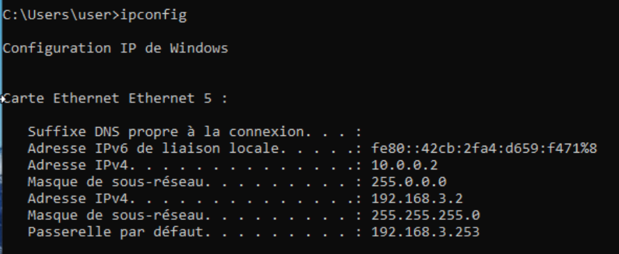
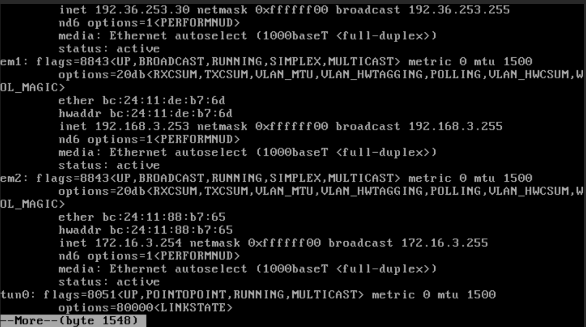
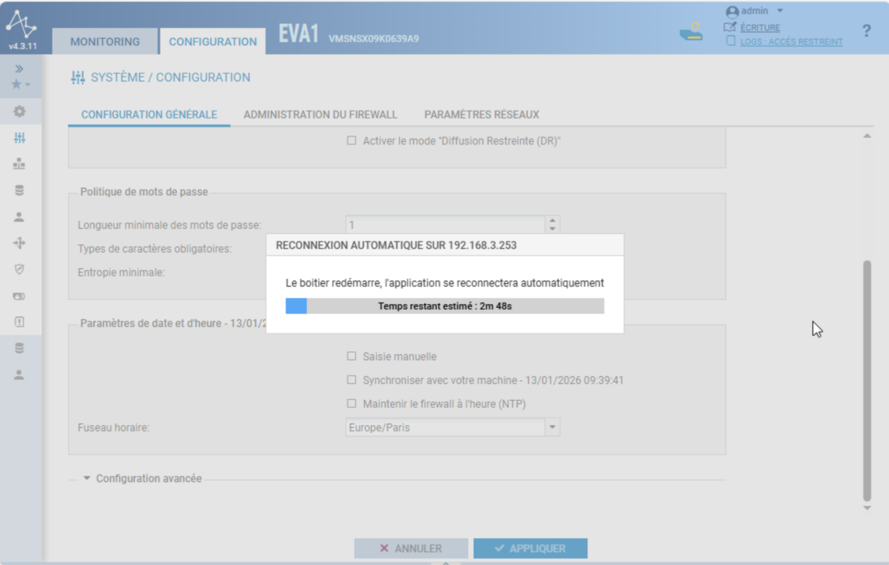
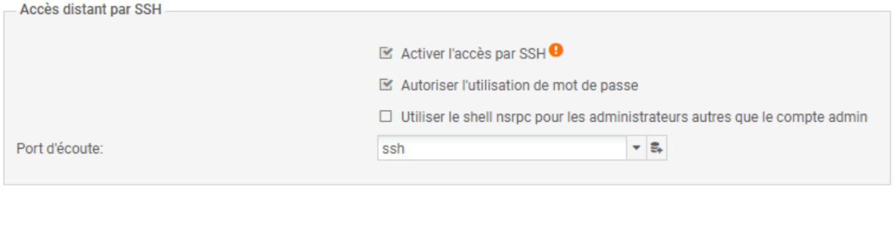
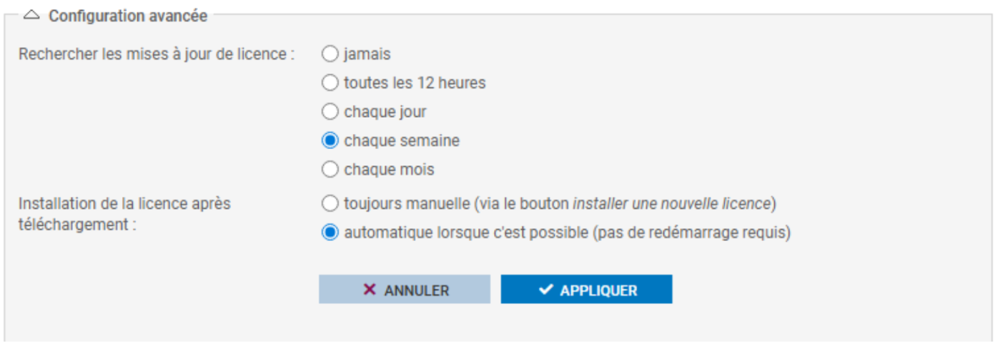
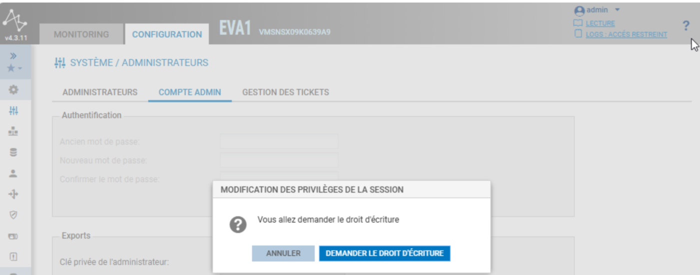
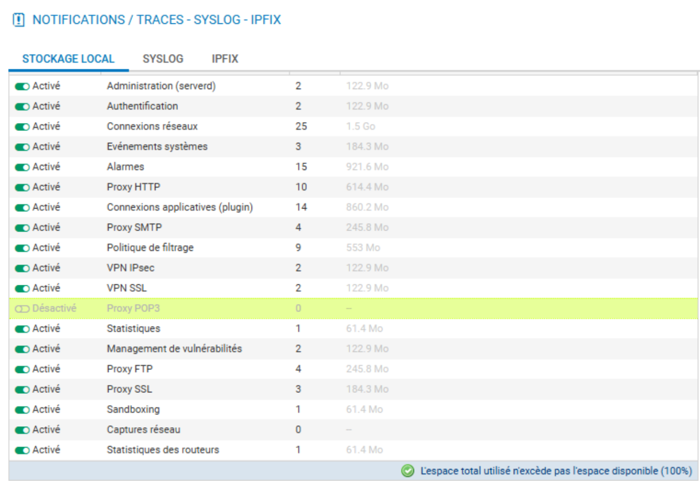
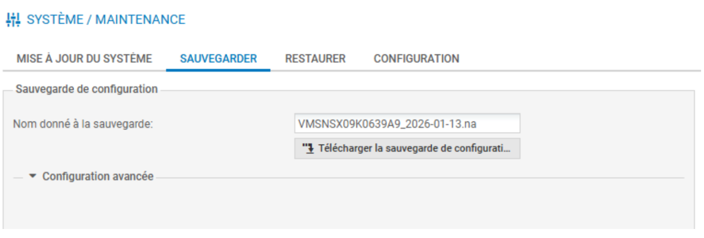

# 01 - Configuration Initiale et Gestion des Logs (Stormshield SNS)

## Objectif du Lab
Ce lab couvre l'initialisation d'un pare-feu Stormshield Network Security (SNS) dans un environnement d'entreprise simulé. L'objectif est de sécuriser l'accès au plan d'administration (Management Plane), d'assurer la conformité temporelle (NTP) et d'optimiser le stockage des logs pour une surveillance SOC efficace.

---

## 1. Contexte et Topologie (Architecture)

Dans le cadre de ce déploiement, j'opère sur l'infrastructure de la **Compagnie C (ID 3)**.
J'ai segmenté le réseau en trois zones de sécurité distinctes pour respecter le principe de moindre privilège :

* **LAN (Trust) :** Zone interne protégée pour l'administration.
* **DMZ (Demilitarized) :** Zone isolée hébergeant les services publics (Web, Mail, DNS).
* **WAN (Untrust) :** Zone externe non fiable (Internet).

### 🗺️ Schéma Topologique

*(Ce schéma illustre la segmentation réseau et l'adressage IP mis en place)*

### Plan d'Adressage IP
Voici la configuration réseau que j'ai auditée et utilisée pour ce déploiement :

| Zone | Équipement | Rôle | Adresse IP |
| :--- | :--- | :--- | :--- |
| **DMZ** | Serveur Debian | **DNS** | `172.16.3.10` |
| | | **Web** | `172.16.3.11` |
| | | **FTP** | `172.16.3.12` |
| | | **Mail** | `172.16.3.13` |
| **Firewall** | Stormshield (em2) | Passerelle DMZ | `172.16.3.254` |
| | Stormshield (em0) | IP Publique (WAN) | `192.36.253.30` |
| | Stormshield (em1) | Passerelle LAN (Net-IN) | `192.168.3.253` |
| **LAN** | Poste Client | Windows 10 (Admin) | `192.168.3.2` |

**Vérification de la connectivité initiale :**
J'ai d'abord validé la configuration IP de mon poste d'administration et les interfaces du firewall via la console CLI.

*Figure 1 : Vérification de l'IP du poste d'administration via ipconfig*

*Figure 2 : Vérification des interfaces du Firewall via la console CLI*

---

## 2. Initialisation et Paramètres Système (System Hardening)

### Connexion au Firewall
J'ai accédé à l'interface d'administration Web via l'adresse interne `https://192.168.3.253/admin`.
Le certificat SSL étant auto-signé par défaut lors de la première initialisation, j'ai validé l'exception de sécurité pour accéder à la mire de connexion.

*Figure 3 : Premier accès HTTPS et validation du certificat*

### Configuration Générale et Temporelle
Une fois connecté, j'ai procédé aux réglages fondamentaux pour garantir la fiabilité des traces :

1.  **Anti-Lockout :** Modification des préférences pour empêcher la déconnexion automatique pendant la phase de configuration critique.
2.  **Identité et Langue :** Passage de l'interface en Français et définition du fuseau horaire sur **Europe/Paris**.
3. **Reboot obligatoire**.
4.  **Synchronisation NTP (Critique) :** J'ai activé le service NTP (Network Time Protocol).
    * *Justification :* En analyse SOC, des logs non synchronisés sont inutilisables pour la corrélation d'événements et n'ont aucune valeur juridique.

*Figure 4 : Configuration des paramètres régionaux et temporels, puis reboot*

*Figure 5 : Activation de la synchronisation NTP*

---

## 3. Sécurisation des Accès Distants (SSH)

Pour permettre l'administration en ligne de commande (CLI) et le dépannage avancé sans interface graphique, j'ai activé le service SSH.
* **Restriction :** L'accès est protégé par mot de passe.

*Figure 6 : Activation du service SSH dans le menu Administration*

---

## 4. Maintenance et Gestion des Licences

J'ai vérifié l'état des souscriptions de sécurité (IPS, Antivirus, URL Filtering) pour m'assurer que les moteurs de protection sont actifs.
Pour garantir une protection continue contre les nouvelles menaces, j'ai configuré la **mise à jour automatique** de la licence avec une vérification hebdomadaire.

*Figure 7 : Vérification des modules de sécurité actifs*

*Figure 8 : Configuration de la mise à jour automatique hebdomadaire*

---

## 5. Gestion des Privilèges (Droits d'Écriture)

La sécurité du compte `admin` est primordiale. J'ai procédé à la modification du mot de passe par défaut.

Lors de cette manipulation, j'ai expérimenté le mécanisme de verrouillage exclusif de Stormshield :
* Le firewall n'autorise qu'un seul administrateur en **Écriture** à la fois.
* Suite à une reconnexion, j'ai dû explicitement **"Demander les droits d'écriture"** pour pouvoir modifier la configuration, ma session précédente étant passée en Lecture Seule.

*Figure 9 : Modification du mot de passe Administrateur*

*Figure 10 : Mécanisme de demande de privilèges d'écriture*

---

## 6. Optimisation des Logs (Stratégie SOC)

La configuration par défaut du stockage des logs n'est pas adaptée à une surveillance de sécurité moderne. L'espace disque est limité et fonctionne par quotas.

**Mon action d'optimisation :**
1.  **Désactivation du Proxy POP3 :** Ce protocole de messagerie étant obsolète et non utilisé, j'ai réduit son quota à 0% et désactivé ses logs.
2.  **Augmentation des Logs Réseau :** J'ai réalloué l'espace libéré à la catégorie **"Connexions Réseau"**.
    * *Objectif :* Augmenter la durée de rétention des traces de trafic pour permettre des investigations plus longues en cas d'incident.

*Figure 11 : Réallocation des quotas de stockage (POP3 désactivé, Réseau augmenté)*

---

## 7. Sauvegarde et Résilience (Disaster Recovery)

Avant de clore l'intervention, j'ai généré une sauvegarde complète de la configuration (fichier `.na`).
Cette étape est indispensable pour assurer un retour à un état stable (Snapshot) avant d'entamer la configuration des politiques de filtrage dans les prochains labs.

*Figure 12 : Génération et téléchargement du fichier de sauvegarde .na*

---
*Fin du rapport de Lab 1.*