# 02 - Gestion des Objets Réseaux (Network Objects Management)

## Objectif du Lab
L'objectif de ce laboratoire est de structurer la base de données d'objets du pare-feu Stormshield. Cette étape est un prérequis indispensable avant la mise en place de politiques de sécurité (Filtrage et NAT). L'intervention couvre la création d'objets hôtes, réseaux, services, groupes, la configuration du DNS système, et l'automatisation via l'import/export CSV.

---

## 1. Définition de l'Infrastructure Distante

Dans un scénario d'interconnexion entre deux sites (Compagnie C vers Compagnie B), j'ai commencé par définir les objets représentant l'infrastructure distante. Cette étape permet d'identifier clairement les destinations externes dans les futures règles de routage ou de VPN.

**Création de l'objet Pare-feu Distant (Gateway) :**
J'ai créé l'objet machine `Fw_B` correspondant à l'interface publique du partenaire.

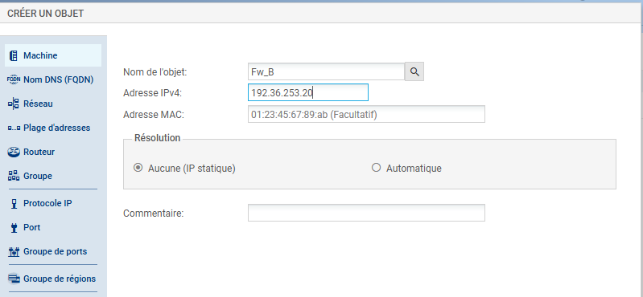
*Définition de l'hôte distant Fw_B (192.36.253.20)*

**Définition du Réseau Distant :**
J'ai ensuite déclaré le réseau local distant `LANinB` pour permettre le routage vers ce sous-réseau spécifique.

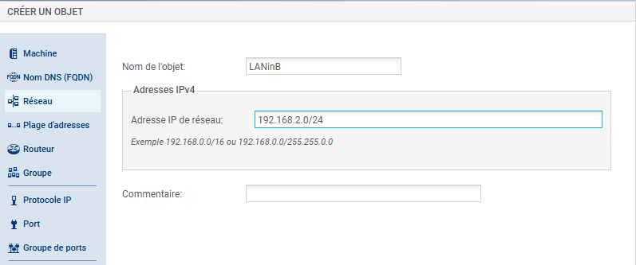
*Définition du réseau distant 192.168.2.0/24*

---

## 2. Création de Services Personnalisés

Afin de gérer des flux applicatifs spécifiques non standards, j'ai créé un objet de type "Port".
Le service `webmail` a été défini sur le port TCP 808. Cela permettra d'ouvrir des flux précis sans exposer les ports standards HTTP/HTTPS inutilement.

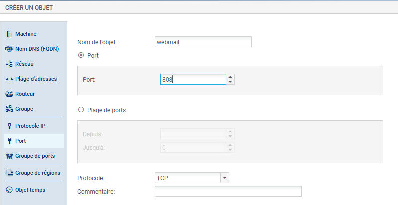
*Définition du service personnalisé TCP/808*

---

## 3. Définition des Actifs Locaux (LAN et DMZ)

J'ai procédé au peuplement de la base d'objets avec les machines de mon infrastructure (Compagnie C).

**Poste d'Administration :**
Création de l'objet pour mon poste de gestion situé dans le LAN.

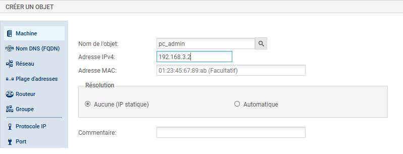
*Objet machine pour le poste d'administration*

**Serveurs de la DMZ :**
J'ai créé les objets pour les quatre serveurs critiques hébergés dans la zone démilitarisée (DMZ).

* **Serveur DNS Privé :**

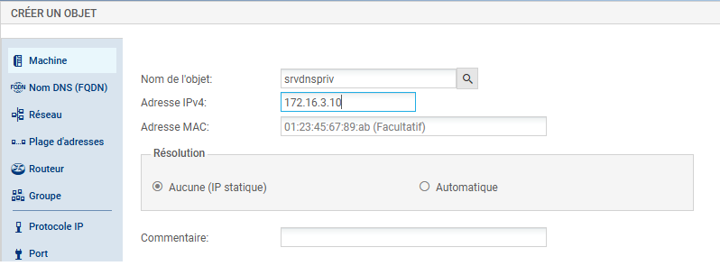

* **Serveur Web Privé :**

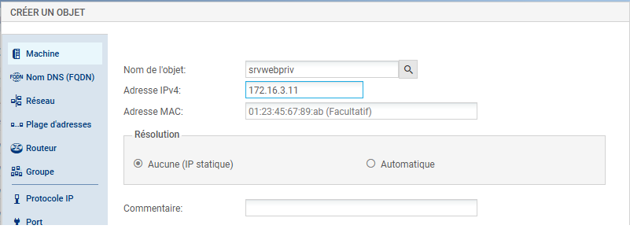

* **Serveur FTP Privé :**

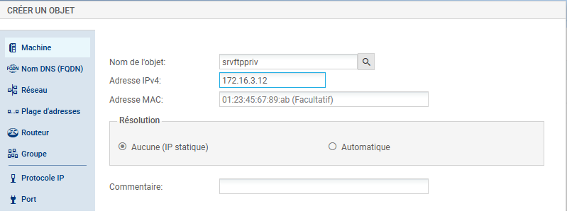

* **Serveur Mail Privé :**

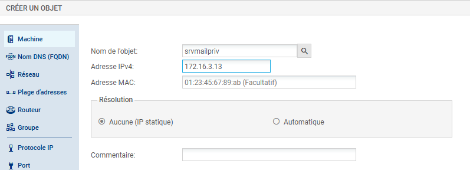

---

## 4. Groupement d'Objets (Simplification de l'Administration)

Pour respecter les bonnes pratiques d'administration et simplifier la lecture des règles de sécurité, j'ai regroupé les serveurs de la DMZ dans un objet de type Groupe nommé `grp_srv_priv`.
Cela permettra d'appliquer une politique de sécurité unique à l'ensemble de ces serveurs.

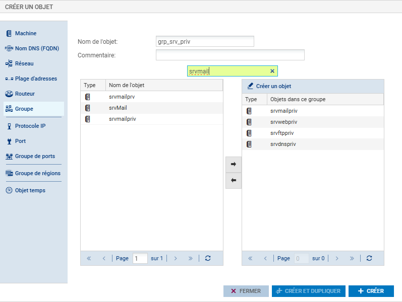
*Regroupement des serveurs DMZ dans un objet Groupe*

---

## 5. Configuration du DNS Système

Par défaut, le pare-feu utilisait les DNS publics de Google. J'ai modifié cette configuration pour utiliser la passerelle du laboratoire, assurant une résolution de noms conforme à la topologie du réseau de formation.

**Création de l'objet Passerelle :**
J'ai d'abord défini l'objet représentant la passerelle du réseau NAT.

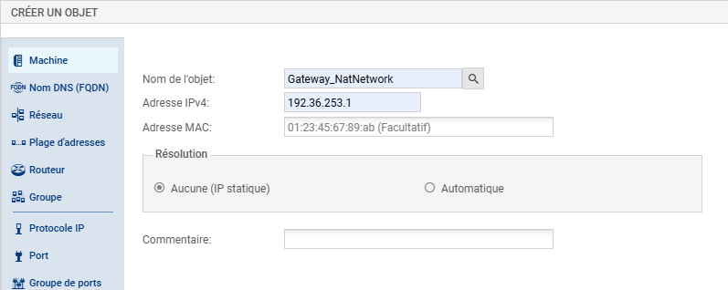
*Objet machine pour la passerelle DNS (192.36.253.1)*

**Modification des Paramètres Réseaux :**
J'ai supprimé les serveurs DNS par défaut et appliqué le nouveau serveur de résolution.

*Avant modification (DNS Google par défaut) :*
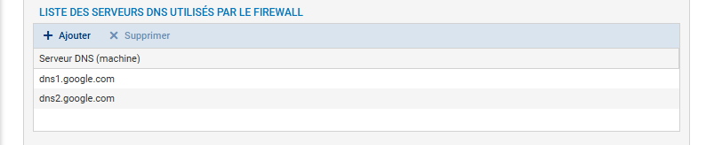

*Après modification (DNS Passerelle Lab) :*
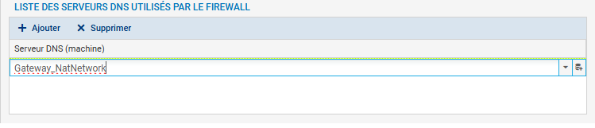
*Nouvelle configuration DNS du système*

---

## 6. Automatisation et Gestion de Masse (CSV)

Pour démontrer ma capacité à gérer des déploiements massifs ou des migrations, j'ai utilisé les fonctions d'import/export CSV du pare-feu.

**Export de la Base Existante :**
J'ai extrait la configuration actuelle pour obtenir un document au format CSV.

*Exportation de la base d'objets*

**Édition du Fichier CSV (Méthode Différentielle) :**
J'ai édité le fichier pour ajouter manuellement deux nouveaux serveurs publics (`srvftppub` et `srvmailpub`) en respectant la syntaxe Stormshield.

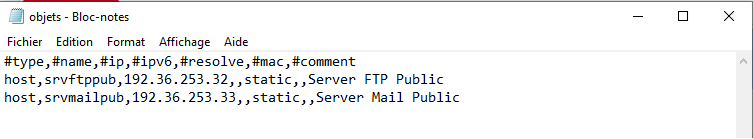
*Ajout manuel d'objets dans le fichier CSV*

### Analyse Critique du Mécanisme d'Import
Lors de cette manipulation, j'ai pris en compte le comportement spécifique du moteur d'importation Stormshield :
* **Règle d'Écrasement :** Si un objet importé porte le **même nom** qu'un objet existant, le pare-feu **écrase** ses propriétés par celles du fichier CSV.
* **Création :** Si l'objet n'existe pas, il est créé.

*Observation :* Si j'avais réimporté le fichier complet (contenant tous les objets existants + les 2 nouveaux), le résultat aurait été fonctionnellement identique : les objets existants auraient été écrasés par leurs propres valeurs (sans changement visible) et les nouveaux auraient été ajoutés.
Cependant, pour respecter les bonnes pratiques (principe de précaution), j'ai choisi de créer un fichier CSV "propre" ne contenant **que les nouveaux objets**, évitant ainsi toute modification accidentelle de la base existante.

**Importation et Vérification :**
J'ai réimplanté le fichier modifié. Le pare-feu a intégré les nouvelles entrées sans altérer la configuration existante.

*Confirmation de l'importation réussie des nouveaux objets*

---
*Fin du rapport de Lab 2.*