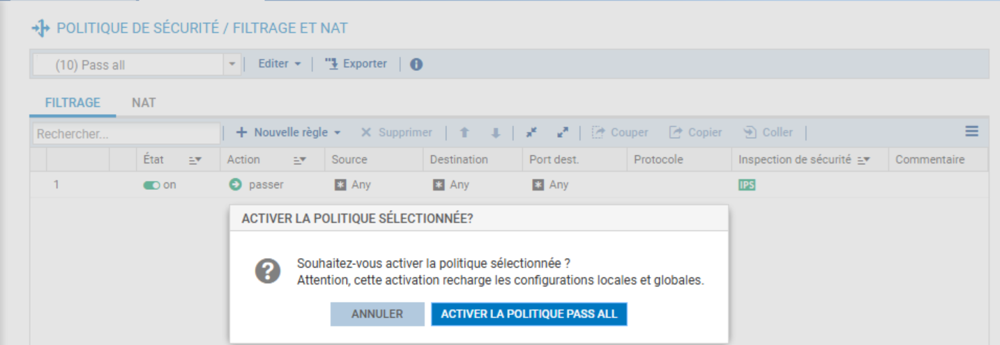
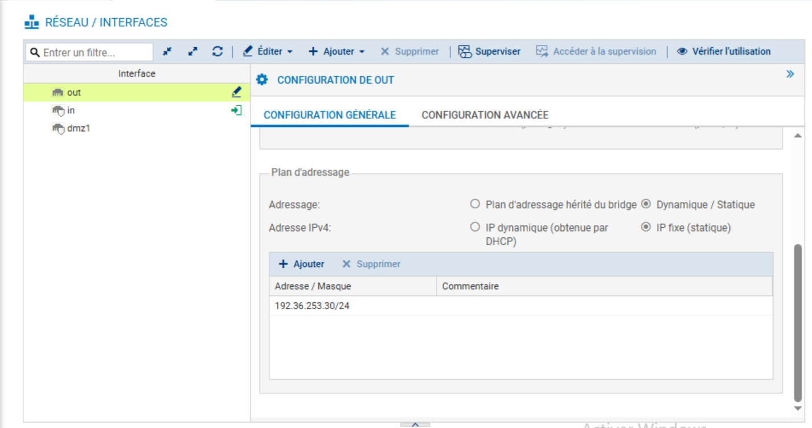
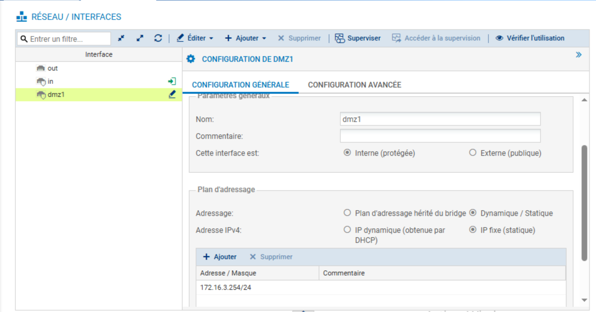
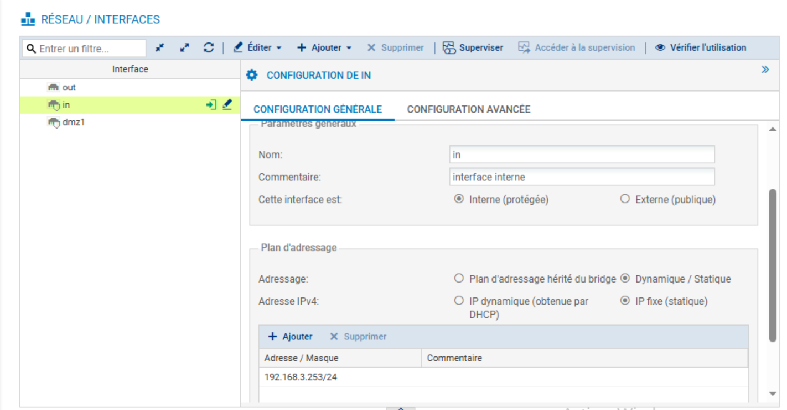
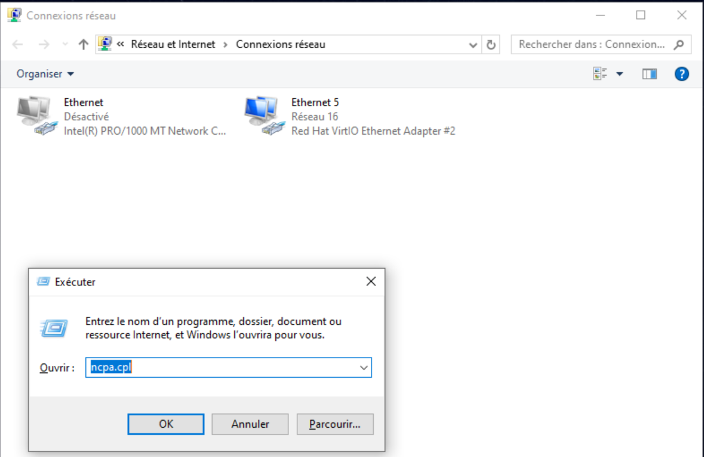
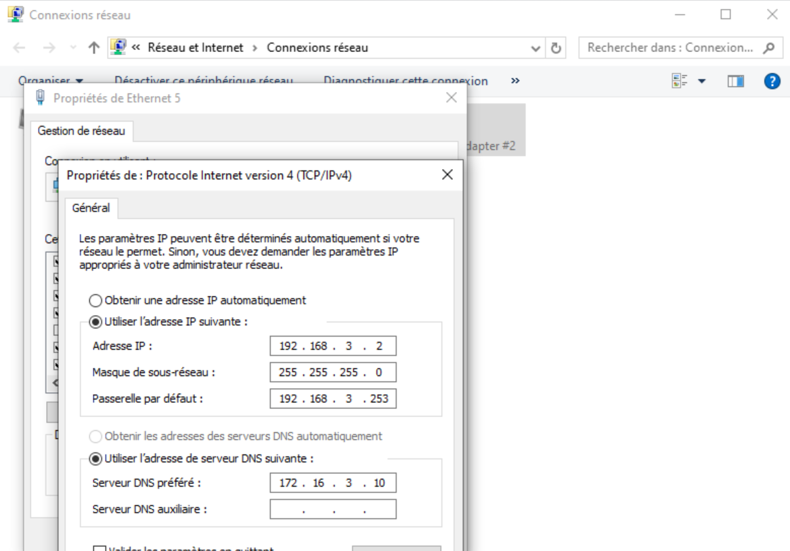

# 03 - Configuration Réseau : Interfaces

## Objectif du Lab
L'objectif de ce module est de configurer la connectivité réseau du pare-feu Stormshield pour interconnecter les différentes zones de l'infrastructure : le réseau public (WAN), la zone démilitarisée (DMZ) et le réseau interne (LAN). Cette étape transforme le boîtier en routeur central de l'architecture.

---

## 1. Préparation de la Politique de Sécurité
Avant de modifier les paramètres réseaux, j'ai temporairement ouvert les flux de sécurité pour éviter de perdre la main sur l'administration ou de bloquer les tests de connectivité légitimes durant la configuration.

J'ai activé la politique de filtrage **(10) Pass all** qui autorise tout le trafic.

*Application de la politique permissive pour la phase de configuration réseau*

> **Note importante :** J'ai maintenu cette politique active pour faciliter les prochains laboratoires (Routage et NAT) et éviter les blocages lors des tests de connectivité. Je note toutefois qu'en environnement de production, laisser une règle "Pass All" permanente constitue une faille de sécurité majeure. Il sera impératif de revenir à une politique restrictive dès la validation de l'architecture réseau.
---

## 2. Configuration des Interfaces Réseaux
J'ai configuré les interfaces physiques du pare-feu pour correspondre au plan d'adressage de la "Compagnie 3" (mon identifiant de stagiaire).

### Interface OUT (Accès Internet)
J'ai configuré l'interface `out` pour permettre la connexion vers le routeur de bordure du laboratoire.
* **Type :** Interface Externe (Publique).
* **Adresse IP :** Statique (`192.36.253.30/24`).

*Définition de l'interface publique WAN*

### Interface DMZ1 (Zone Serveurs)
J'ai configuré l'interface `dmz1` qui servira de passerelle pour les serveurs publics (Web, Mail, DNS).
* **Type :** Interface Interne (Protégée).
* **Adresse IP :** Statique (`172.16.3.254/24`).

*Définition de la passerelle pour la zone DMZ*

### Interface IN (Réseau Interne)
J'ai configuré l'interface `in` qui connecte le poste d'administration et le réseau utilisateur.
* **Type :** Interface Interne (Protégée).
* **Adresse IP :** Statique (`192.168.3.253/24`).

*Définition de la passerelle pour le réseau LAN*

---

## 3. Vérification du Client d'Administration
Afin de maintenir la communication avec l'interface `IN` du pare-feu, j'ai vérifié la configuration réseau de mon poste d'administration (Windows). Cette configuration, initiée lors du déploiement, doit correspondre au nouveau plan d'adressage du pare-feu.

J'ai accédé aux connexions réseaux via la commande `ncpa.cpl` :

*Sélection de l'interface réseau active (Ethernet 5)*

J'ai validé que les paramètres IPv4 pointent bien vers la nouvelle adresse de l'interface `IN` du firewall comme passerelle par défaut :
* **Adresse IP du poste :** `192.168.3.2`
* **Masque :** `255.255.255.0`
* **Passerelle par défaut :** `192.168.3.253` (Adresse de l'interface IN configurée précédemment)
* **Serveur DNS :** `172.16.3.10` (Serveur DNS situé dans la DMZ)

*Vérification de la connectivité client vers le Firewall*

---
*Fin du rapport de Lab 3.*