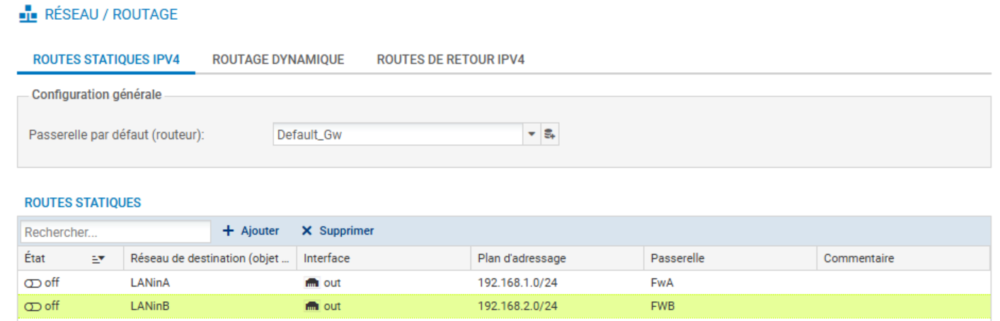
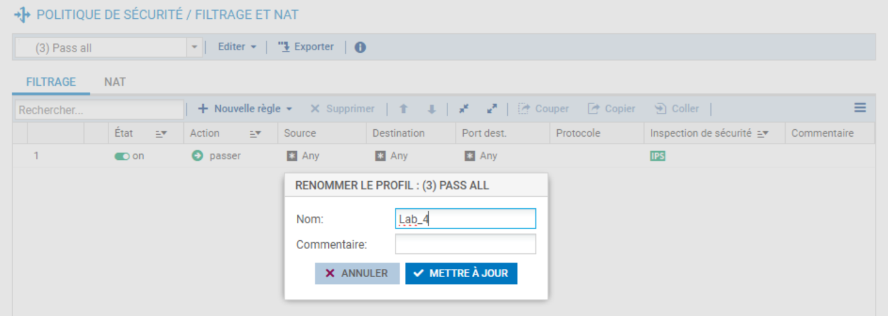
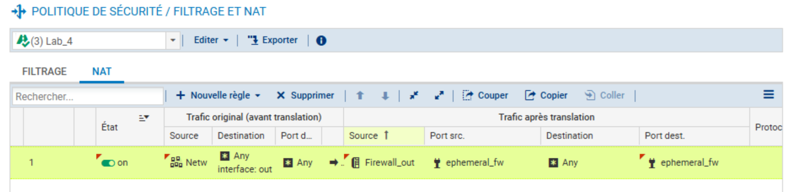
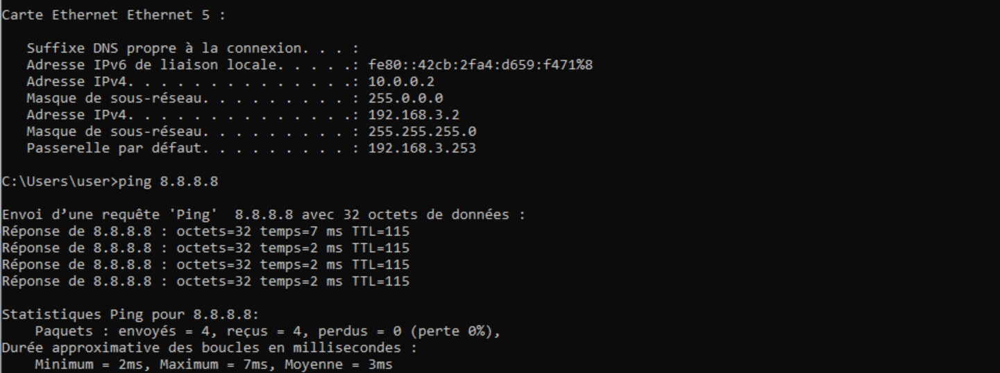
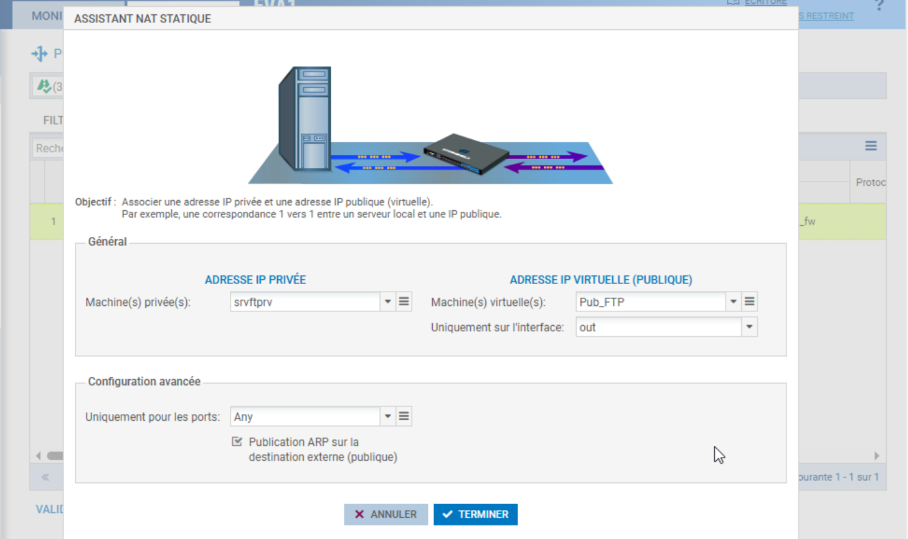
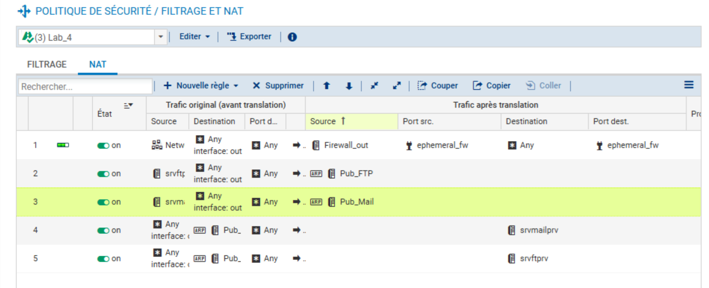
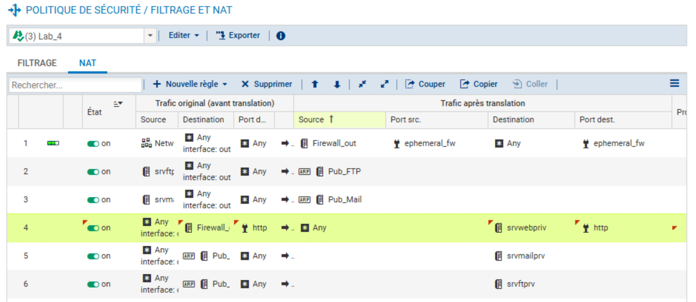
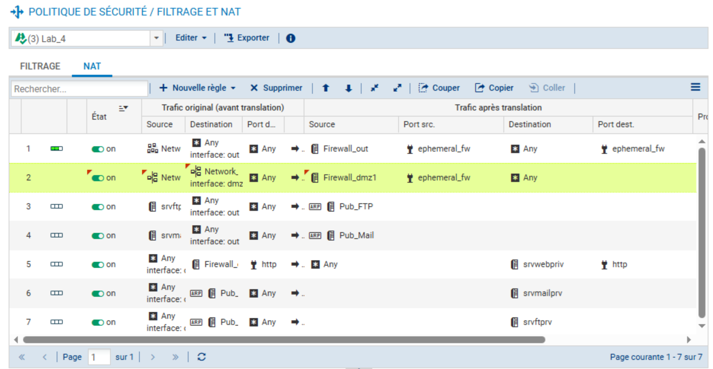

# 04 - Configuration de la Translation d'Adresses (NAT)

**Environnement :** Lab virtuel — Formation CSNA Stormshield (CyberUniversity x La Sorbonne)

## Objectif du Lab
L'objectif de ce module est de configurer les mécanismes de translation d'adresses (NAT) sur le pare-feu Stormshield. Il s'agit de permettre l'accès à Internet pour les réseaux internes via une adresse IP publique unique (Source NAT) et de rendre accessibles les services hébergés en DMZ (FTP, Mail, Web) depuis l'extérieur (Destination NAT). Une attention particulière est portée à la gestion de la pénurie d'adresses IPv4 et à la sécurisation des flux par l'obscurcissement de la topologie interne.

## Outils et Technologies
* Pare-feu Stormshield Network Security (SNS) - Interface d'administration Web
* Poste Client Windows (Zone LAN)
* Serveurs Linux (Zone DMZ)
* Mécanismes NAT : Masquerading, BIMAP (Static NAT), Port Forwarding (PAT)

---

## 1. Préparation de l'environnement
Dans une approche de type "Blue Team", il est impératif de s'assurer que les configurations précédentes n'interfèrent pas avec les nouveaux tests, garantissant ainsi l'intégrité des résultats.

J'ai commencé par désactiver les routes statiques spécifiques créées lors du laboratoire précédent (Lab 03). Le but est de forcer le pare-feu à utiliser sa route par défaut vers Internet pour simuler un environnement de production réel.

*Désactivation de la route vers le réseau partenaire pour utiliser la passerelle par défaut*

Ensuite, afin de préserver la politique de sécurité par défaut et de travailler dans un environnement cloisonné ("Sandbox"), j'ai dupliqué la politique `(10) Pass all` vers un emplacement libre, que j'ai renommé `Lab_4`.

*Duplication et renommage de la politique de sécurité pour le laboratoire*

---

## 2. Configuration du NAT Dynamique (Masquerading)
Pour permettre aux machines des réseaux internes (LAN et DMZ) de communiquer avec Internet, j'ai mis en place une translation d'adresse source dynamique.

J'ai utilisé l'objet système implicite `Network_internals`, qui regroupe dynamiquement toutes les interfaces protégées. Cette méthode assure que toute future interface interne bénéficiera automatiquement de l'accès Internet sans modification de la règle.

**Détails de la règle :**
* **Source originale :** `Network_internals`
* **Destination originale :** `Any` (Internet)
* **Interface de sortie :** `out`
* **Source translatée :** `Firewall_out` (192.36.253.30)
* **Port source translaté :** `ephemeral_fw` (Ports aléatoires)

*Règle de partage d'adresse source permettant l'accès Internet*

J'ai vérifié la connectivité depuis le poste client avec un test ICMP vers un DNS public (8.8.8.8), confirmant que l'adresse privée du client est bien masquée derrière l'IP publique du pare-feu.

*Test de connectivité réussi depuis le client LAN vers Internet*

---

## 3. Configuration du NAT Statique (BIMAP)
L'organisation disposant de deux adresses IP publiques supplémentaires, j'ai configuré une translation statique bidirectionnelle (BIMAP) pour les serveurs FTP et Mail. Cela permet de dédier une IP publique spécifique à chaque service critique.

J'ai utilisé l'assistant de création pour générer automatiquement les paires de règles (Entrant/Sortant) et, point crucial, pour activer la **Publication ARP** (Proxy ARP). Sans cette publication, le routeur du fournisseur d'accès ne pourrait pas résoudre l'adresse MAC associée à ces IP virtuelles, rendant les services inaccessibles.

**Configurations appliquées :**
* **FTP :** `srvftprv` (172.16.3.12) <-> `Pub_FTP` (192.36.253.32)
* **Mail :** `srvmailpriv` (172.16.3.13) <-> `Pub_Mail` (192.36.253.33)

*Association d'une IP publique dédiée au serveur FTP avec publication ARP*

*Vue des règles bidirectionnelles générées pour FTP et Mail*

---

## 4. Configuration de la Redirection de Port (PAT)
N'ayant plus d'adresses IP publiques disponibles pour le serveur Web, j'ai opté pour une stratégie de "Port Forwarding" (Destination NAT). J'ai configuré le pare-feu pour écouter sur son adresse IP principale et rediriger uniquement le flux HTTP vers le serveur interne.

**Détails de la règle :**
* **Trafic entrant :** Vers `Firewall_out` (192.36.253.30) sur le port `http` (80).
* **Translation :** Redirection vers `srvwebpriv` (172.16.3.11).

Cette approche minimise la surface d'attaque en n'exposant que le port strictement nécessaire, contrairement au BIMAP qui expose techniquement tous les ports (bien que filtrés par la suite).

*Configuration de la règle PAT pour l'accès Web HTTP*

---

## 5. Configuration Avancée : Masquage du LAN vers la DMZ
Dans une optique de durcissement (Hardening), j'ai ajouté une règle de NAT pour les flux provenant du LAN à destination de la DMZ.

**Objectif :** Masquer le plan d'adressage du réseau utilisateur vis-à-vis des serveurs publics.

**Détails de la règle :**
* **Source :** `Network_in`
* **Destination :** `Network_dmz1`
* **Translation :** L'IP source devient `Firewall_dmz1` (Interface du firewall dans la DMZ).

*Masquage des IP du LAN lors de l'accès aux serveurs DMZ*

### Analyse critique (Blue Team)
Cette configuration présente un compromis important :
1.  **Avantage Sécurité :** Si un serveur de la DMZ est compromis, l'attaquant ne peut pas énumérer les adresses IP des clients du LAN via les logs du serveur (netstat, access logs), car tout le trafic semble provenir du pare-feu (`172.16.3.254`).
2.  **Inconvénient Traçabilité :** Pour un Analyste SOC, cette configuration complique l'investigation. Les logs applicatifs sur le serveur Web n'affichent plus l'identité réelle du client. La corrélation de logs entre le pare-feu et le serveur devient indispensable pour retracer une action malveillante interne.

---

## Implications pour un Analyste SOC
La mise en place du NAT impacte directement la visibilité et la surveillance du réseau :

1.  **Obfuscation des sources :** Le NAT masque l'adresse IP source réelle. Lors de l'analyse d'incidents (Forensics), il est crucial de se rappeler que l'IP visible dans les logs externes (ou DMZ dans le cas du bonus) est celle du pare-feu, pas celle de l'attaquant ou de la machine infectée.
2.  **Importance des logs de translation :** Il est impératif d'activer les traces (logs) sur les règles de NAT critiques. Sans cela, il est impossible de faire le lien entre une connexion sortante malveillante et la machine interne compromise ("Patient Zero").
3.  **Validation ARP :** Lors de diagnostics réseau, l'absence de publication ARP sur des règles de NAT statique est une cause fréquente d'indisponibilité de service qu'un analyste doit savoir identifier rapidement.
4. **Surface d'attaque :** Le PAT (redirection de port) expose moins que le BIMAP. 
   En audit de sécurité, privilégier le PAT quand une seule application doit être 
   accessible réduit le risque d'exploitation de services non intentionnels.

---
*Fin du rapport de Lab 4.*