# Lab 05 : Configuration de Pare-feu & Filtrage de Trafic

**Environnement :** Lab virtuel — Formation CSNA Stormshield (CyberUniversity x La Sorbonne)

## Objectif du Lab
L'objectif principal de ce laboratoire était de configurer un pare-feu Stormshield Network Security (SNS) pour sécuriser une architecture réseau multi-zones (LAN, DMZ, WAN). L'accent a été mis sur la mise en œuvre d'une politique de sécurité stricte basée sur le principe de moindre privilège, la configuration de la traduction d'adresses réseau (NAT) pour les flux entrants et sortants, et l'établissement d'un cadre de surveillance via la journalisation et les alarmes.

## Outils & Technologies
* **Stormshield Network Security (SNS) :** Appliance Pare-feu (Virtuelle)
* **Infrastructure Réseau :** DMZ (Serveurs), LAN (Clients), WAN (Internet simulé)
* **Protocoles :** HTTP/HTTPS, FTP, SMTP, DNS, ICMP, SSH
* **Administration :** Interface Web d'Administration (HTTPS)

## Configuration et Mise en œuvre

### 1. Définition des Objets et Segmentation Réseau
Pour garantir une politique de sécurité granulaire, j'ai commencé par définir des objets réseau précis. Cette approche évite l'utilisation d'adresses IP brutes dans les règles, rendant la politique plus lisible et plus facile à maintenir.

J'ai défini des postes de travail spécifiques, comme le PC du stagiaire, pour y appliquer des restrictions ciblées par la suite.

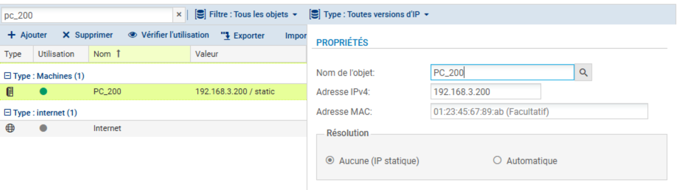

J'ai également configuré des objets FQDN (Fully Qualified Domain Name) pour gérer le filtrage basé sur les noms de domaine, ce qui est essentiel pour bloquer des ressources web spécifiques indépendamment de leurs adresses IP changeantes.

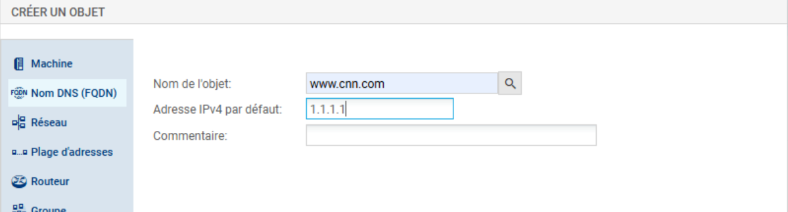

Pour la DMZ, j'ai regroupé les serveurs (Web, FTP, Mail, DNS) ainsi que les ports de service afin de rationaliser le processus de création de règles.

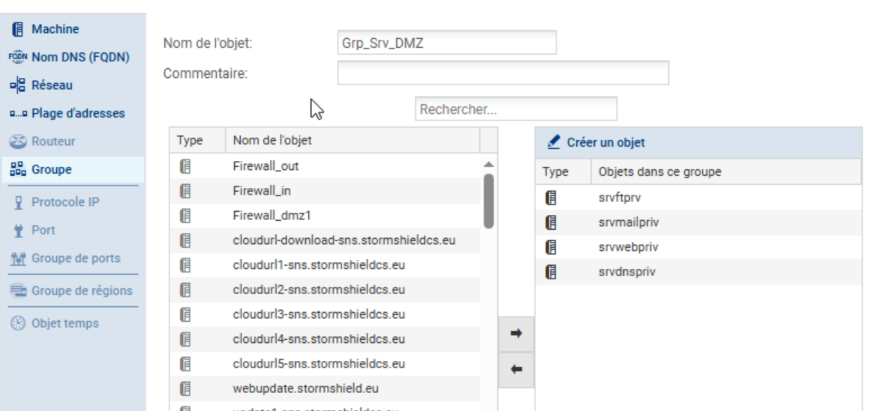
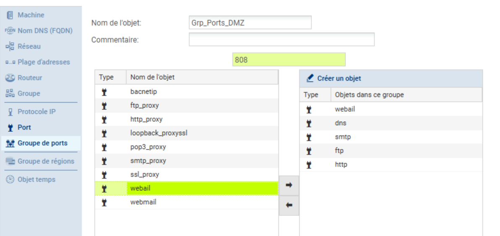

### 2. Traduction d'Adresse Réseau (NAT)
Une configuration NAT correcte est critique pour le routage du trafic entre les zones privées et l'internet public. J'ai mis en œuvre deux types de NAT :
1.  **NAT Source (Masquerading) :** Pour permettre aux hôtes internes (LAN et Serveurs DMZ) d'accéder à Internet en utilisant l'IP publique du pare-feu.
2.  **NAT Destination (Redirection de Port) :** Pour publier les services internes (Web, Mail, FTP) vers l'extérieur.

La configuration ci-dessous montre la politique NAT, incluant la règle de masquerading spécifique `nat_dns_srv_out` qui assure que le serveur DNS interne peut résoudre les requêtes externes.

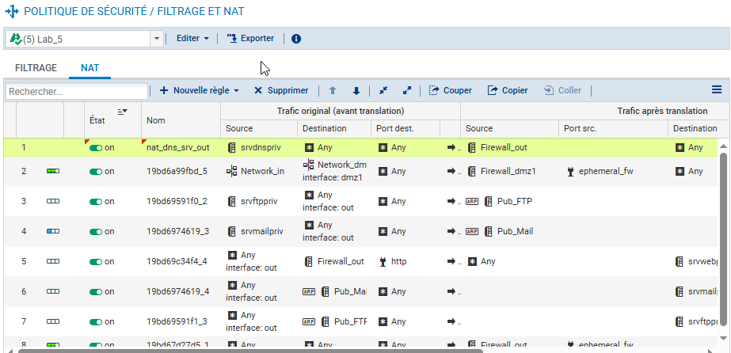

J'ai veillé à ce que le serveur DNS de la DMZ dispose d'une règle de traduction dédiée pour garantir sa capacité à communiquer avec les serveurs racines ou les redirecteurs externes.

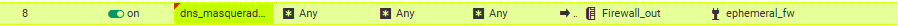

### 3. Politique de Sécurité : Filtrage de Trafic
J'ai adopté une posture de "Refus par défaut" (Default Deny), n'autorisant explicitement que le trafic nécessaire. La politique a été divisée en sections logiques.

#### Flux Sortants (LAN vers Internet)
Dans cette section, j'ai priorisé les règles de blocage pour filtrer le trafic indésirable avant d'autoriser l'accès général.
* **Restrictions :** J'ai bloqué le trafic FTP pour des utilisateurs spécifiques (`PC_200`), l'accès aux sites d'actualités (`www.cnn.com`), et tout trafic vers la Corée du Sud via le filtrage Geo-IP.
* **Autorisations :** J'ai permis la navigation web standard (HTTP/HTTPS), la résolution DNS et les protocoles d'infrastructure spécifiques.

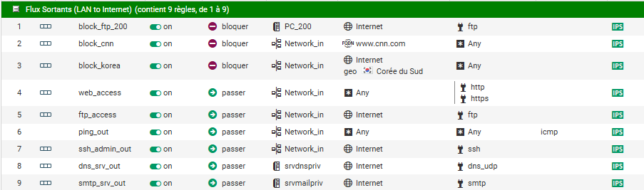

#### Flux Entrants (Internet vers DMZ)
J'ai créé des règles pour autoriser l'accès externe aux services publics hébergés dans la DMZ. Ces règles correspondent aux services publiés via le NAT. J'ai utilisé l'objet source `Any` pour permettre les connexions depuis n'importe où sur Internet.

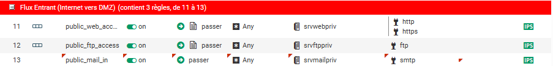

#### Segmentation Interne (LAN vers DMZ)
Pour permettre l'administration interne et l'utilisation des serveurs de la DMZ, j'ai autorisé le trafic du réseau LAN vers le Groupe de Serveurs DMZ, restreint aux ports de service spécifiques.

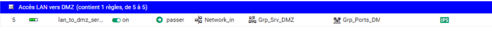

### 4. Surveillance SOC : Alarmes vs Logs
Un pare-feu doit agir comme un outil de détection. J'ai configuré des règles spécifiques pour déclencher des **Alarmes** plutôt que de simples journaux. Cela permet une notification immédiate des activités suspectes, telles que :
* Les scans ICMP (Ping) sur l'interface WAN.
* Les tentatives d'accès au portail d'administration du pare-feu depuis l'internet public.

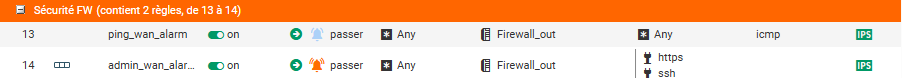

## Vérification et Tests
Après avoir appliqué la configuration, j'ai effectué une série de tests pour valider la posture de sécurité.

### Connectivité & Disponibilité des Services
J'ai vérifié que l'accès internet standard était fonctionnel pour les clients autorisés.

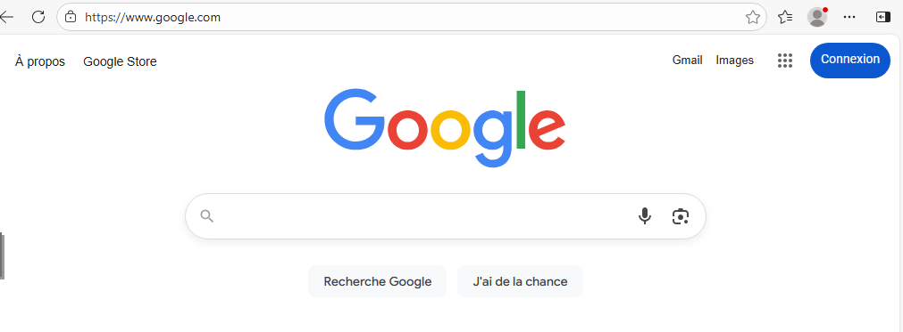
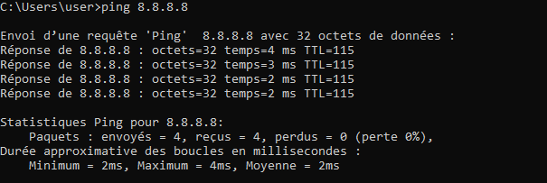

J'ai également confirmé que le serveur Mail interne pouvait communiquer vers l'extérieur, validant la configuration du flux SMTP.

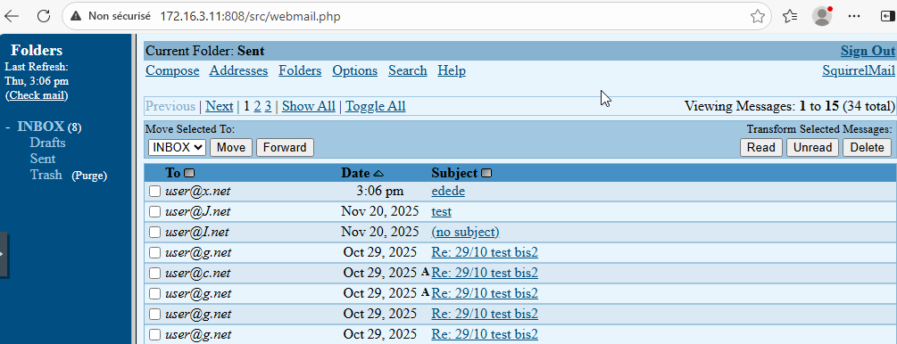

### Application de la Politique (Blocage)
J'ai testé les règles de blocage pour m'assurer que les restrictions étaient actives. L'accès au FQDN interdit (`www.cnn.com`) a été bloqué avec succès.

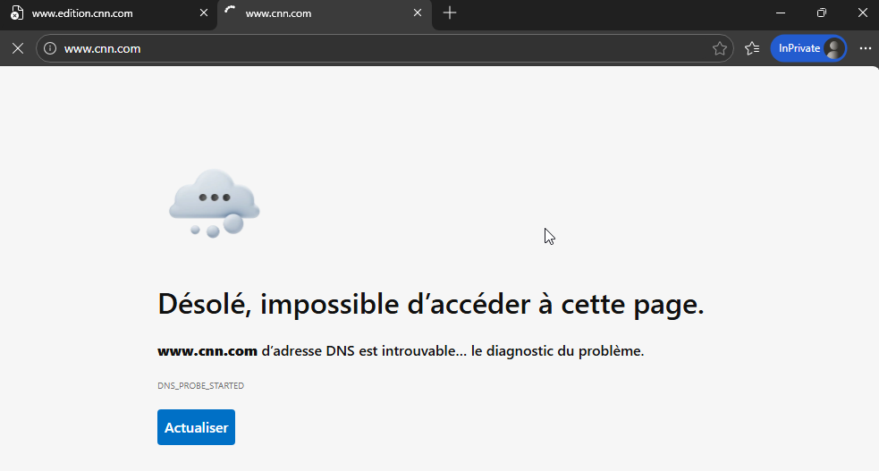

De même, le trafic à destination de la Corée du Sud a été rejeté par le filtre Geo-IP.

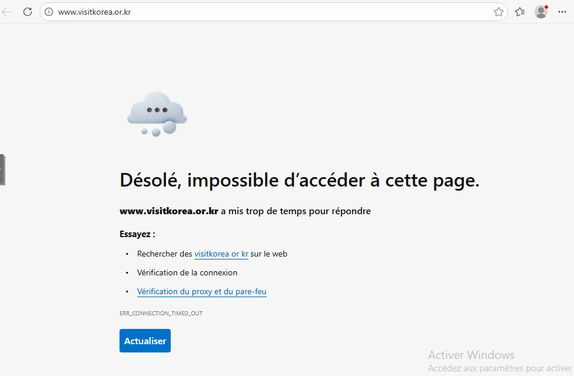

### Surveillance et Logs
Enfin, j'ai vérifié le tableau de bord de surveillance. Les règles spécifiques configurées avec l'action "Alarme" ont généré avec succès des alertes lors du passage du trafic correspondant. Cela confirme la visibilité sur les tentatives de reconnaissance ou d'accès non autorisé.

## Implications pour un Analyste SOC
Du point de vue d'un Analyste SOC, ce laboratoire met en évidence l'importance des points suivants :

1.  **Granularité des Logs :** L'activation des traces sur des règles spécifiques (comme les accès Web/FTP entrants) fournit les données nécessaires à l'analyse forensique en cas d'incident.
2.  **Réduction du Bruit :** En utilisant des Alarmes spécifiques pour les événements à haut risque (accès Admin WAN) plutôt que des logs génériques, nous réduisons la fatigue d'alerte et nous concentrons sur les renseignements exploitables.
3.  **Réduction de la Surface d'Attaque :** La segmentation stricte entre le LAN et la DMZ, combinée au géo-blocage, limite considérablement les vecteurs qu'un attaquant peut exploiter.
4.  **Vérification :** L'écart possible entre une règle configurée et l'accès effectif (testé via navigateur/ping) souligne la nécessité de tests de sécurité et de validations continus.
5. **Objets FQDN vs IP :** Le blocage par nom de domaine (CNN) reste efficace même si l'infrastructure cible change d'adresse IP. C'est une approche plus résiliente que le blocage par IP, particulièrement pertinente pour les CDN et services cloud.

---
*Fin du rapport de Lab 5.*