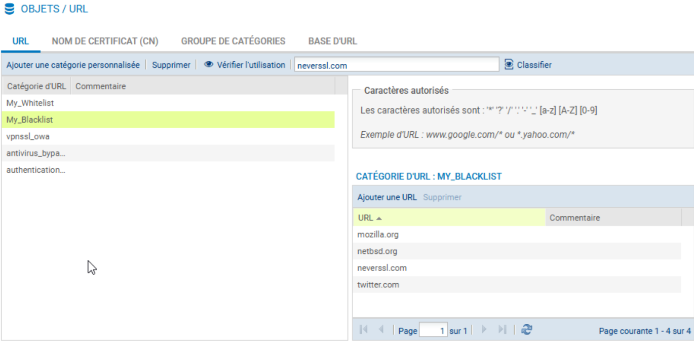
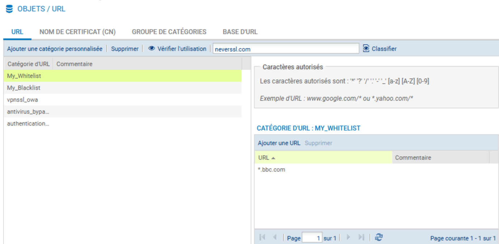
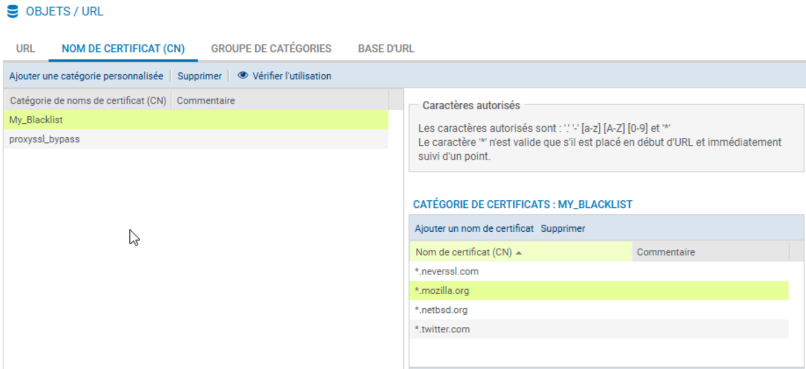
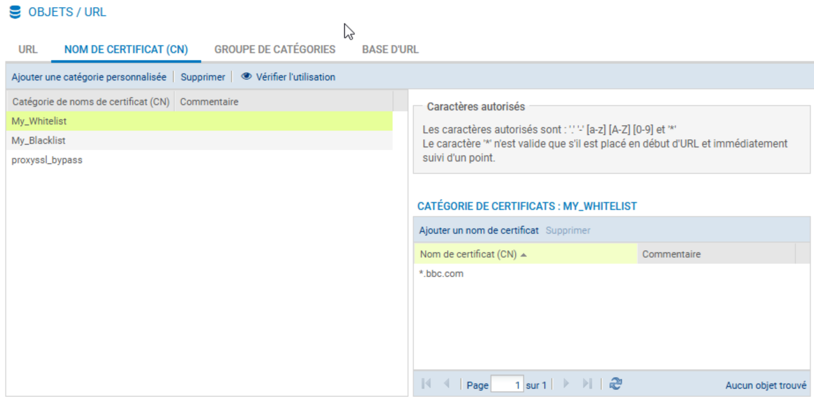
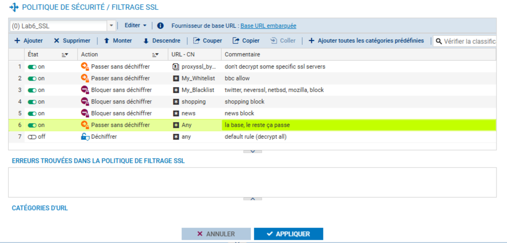
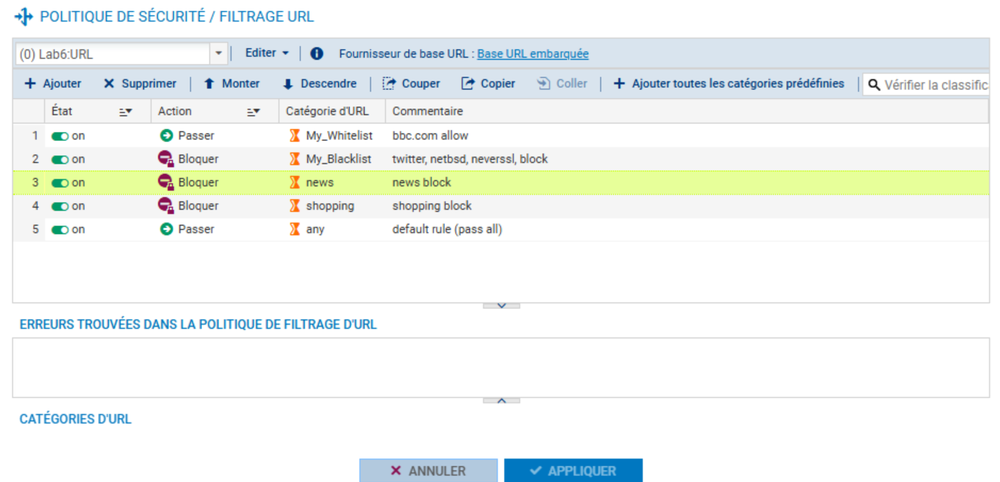
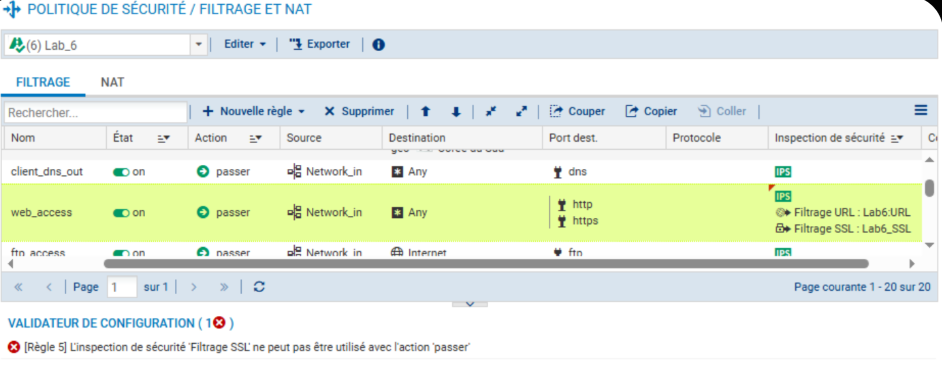
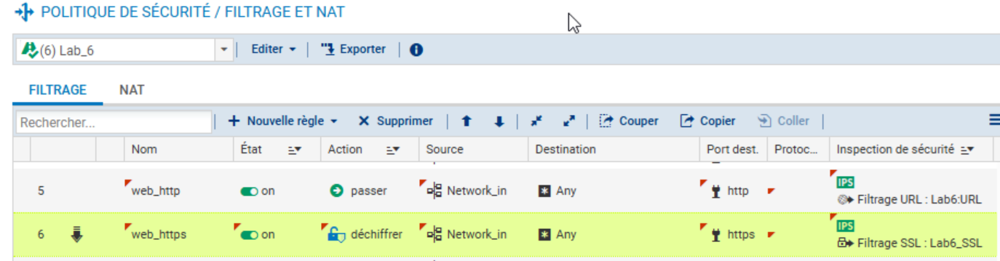
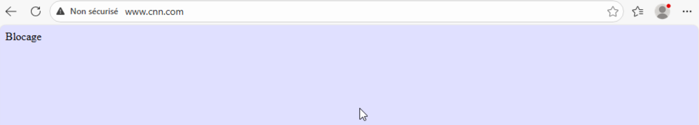

# Lab 06 : Filtrage de Contenu Web (HTTP & HTTPS) — Stormshield Network Security

**Environnement :** Lab virtuel — Formation CSNA Stormshield (CyberUniversity x La Sorbonne)

## Objectif du Lab
L'objectif de ce module était de durcir la politique de sécurité en passant d'un filtrage réseau (couches 3/4) à un filtrage applicatif (couche 7). La mission principale consistait à contrôler l'accès aux ressources Web non seulement par URL (pour le HTTP), mais surtout pour les flux chiffrés (HTTPS) via l'analyse du SNI (Server Name Indication), sans nécessairement recourir au déchiffrement SSL complet (Man-in-the-Middle).

## Outils & Technologies
* **Stormshield Network Security (SNS) :** Moteur de filtrage URL et inspection SSL.
* **Base d'URL Embarquée :** Classification native des domaines.
* **Protocoles :** HTTP (80) et HTTPS (443).
* **Mécanismes de sécurité :** Inspection SNI, Gestion des objets CN (Certificate Name).

## Configuration et Analyse Défensive

### 1. Classification et Gestion des Objets
Pour appliquer une politique de moindre privilège efficace, j'ai d'abord analysé la classification des sites cibles dans la base embarquée. Une approche défensive rigoureuse nécessite de ne pas se reposer uniquement sur les catégories par défaut. J'ai donc segmenté les cibles en créant des groupes d'objets personnalisés.

J'ai créé une "Blacklist" personnalisée pour isoler les domaines explicitement interdits (Twitter, NetBSD, Mozilla, NeverSSL) et une "Whitelist" pour les exceptions critiques (BBC).

Pour assurer la cohérence du filtrage sur les deux protocoles, j'ai répliqué ces objets pour le filtrage HTTP (URL) et pour le filtrage HTTPS (Noms de certificats/CN).

Cette granularité permet d'éviter les effets de bord d'un blocage catégoriel trop large.

### 2. Stratégie de Filtrage SSL (Flux Chiffrés)
La majorité du trafic étant chiffrée, le défi consistait à bloquer des catégories (Shopping, News) tout en autorisant une exception spécifique (BBC, qui est un site de News).

J'ai configuré la politique SSL en respectant scrupuleusement l'ordre de traitement des règles (First Match). L'exception (Whitelist) doit impérativement être placée avant le blocage global de la catégorie, sinon le trafic légitime serait rejeté.

On note ici l'action "Passer sans déchiffrer" pour le trafic autorisé. Cela permet au pare-feu de valider le domaine via le SNI du *Client Hello* TLS sans casser le tunnel chiffré, préservant ainsi la confidentialité des données tout en assurant le contrôle d'accès.

### 3. Stratégie de Filtrage URL (Flux Clairs)
J'ai appliqué une logique miroir sur le filtrage URL standard pour les flux non chiffrés. Bien que le HTTP soit de plus en plus rare, un vecteur d'attaque courant consiste à forcer une dégradation (downgrade) vers du HTTP pour contourner les inspections SSL. La politique URL doit donc être aussi stricte que la politique SSL.

### 4. Implémentation : Contournement d'une Limitation Technique
L'application de ces politiques de sécurité a nécessité une restructuration des règles de filtrage. Une contrainte technique du moteur IPS empêche d'appliquer un profil de filtrage SSL sur une règle dont l'action est simple ("Passer").

Pour contourner cette limitation et appliquer une sécurité stricte, j'ai dissocié les flux :
1.  **Flux HTTP :** Action "Passer" avec inspection URL.
2.  **Flux HTTPS :** Action "Déchiffrer" avec inspection SSL.

L'action "Déchiffrer" ici instruit le moteur d'inspecter le handshake TLS. Cependant, comme ma politique SSL est configurée sur "Passer sans déchiffrer", le déchiffrement effectif (MITM) n'a pas lieu, mais le contrôle d'accès est bien effectué.

J'ai également désactivé le filtrage URL sur la règle HTTPS, car sans déchiffrement complet, le pare-feu ne peut pas lire l'URI complète, rendant le filtrage URL inopérant sur ce flux.

La configuration finale présente une séparation claire des responsabilités par protocole :

### 5. Validation et Comportement du Blocage
Les tests de connectivité ont validé la politique : l'accès à BBC (Whitelist) est fonctionnel, tandis que CNN (Catégorie News) est bloqué.

Un point important pour l'analyse d'incidents est le comportement visuel du blocage SSL. Contrairement au HTTP où une page de blocage explicite est injectée, le blocage HTTPS sans déchiffrement se manifeste par une rupture de connexion (Connection Reset) au niveau du navigateur.

Le pare-feu interrompt le handshake TCP/TLS dès la détection du SNI interdit, empêchant l'établissement du tunnel sécurisé nécessaire à l'affichage d'une page HTML d'avertissement.

## Implications pour un Analyste SOC
Ce laboratoire met en lumière plusieurs points clés pour la surveillance et la défense :

1.  **Importance du SNI :** En tant qu'analyste, il est crucial de comprendre que même sans visibilité sur le contenu chiffré (payload), les métadonnées TLS (SNI) sont suffisantes pour catégoriser et bloquer une grande partie des menaces externes.
2.  **Interprétation des erreurs :** Un utilisateur signalant une "erreur de connexion sécurisée" ou un "ERR_CONNECTION_RESET" ne rencontre pas forcément un problème technique ; c'est souvent la signature d'un blocage de sécurité HTTPS. Il faut savoir distinguer cela d'une panne réseau.
3.  **Gestion des Exceptions :** La logique d'ordre des règles (Whitelist avant Blacklist/Catégorie) est fondamentale. Une mauvaise priorisation est une cause fréquente de faux positifs (blocage de services légitimes) ou de faux négatifs (laisser passer une menace car une règle "Allow Any" était mal placée).
4.  **Limites du filtrage sans déchiffrement :** L'inspection SNI permet de bloquer par domaine, mais pas par chemin d'URL (ex: bloquer youtube.com/watch mais autoriser youtube.com/education). Pour ce niveau de granularité, le déchiffrement complet (MITM) devient nécessaire, avec les implications légales et de confidentialité que cela implique.

---
*Fin du rapport de Lab 6.*