# Rapport de Lab 7 : Authentification et Filtrage Basé sur l'Identité

**Environnement :** Lab virtuel — Formation CSNA Stormshield (CyberUniversity x La Sorbonne)

## Objectif du Lab
L'objectif de ce laboratoire était de passer d'une politique de sécurité basée sur les adresses IP (couche réseau) à une politique basée sur l'identité des utilisateurs (couche 8). Cela implique la configuration d'un annuaire LDAP interne, la mise en place d'un portail captif, l'enrôlement des utilisateurs et la création de règles de filtrage différenciées selon les privilèges des utilisateurs (Administrateurs vs Utilisateurs standards).

## Outils et Technologies
* Firewall Stormshield SNS (EVA1)
* Annuaire LDAP embarqué
* Portail Captif Stormshield
* Clients virtuels pour les tests (ICMP, HTTP)

## Déroulement du Lab et Analyse Technique

### 1. Configuration de l'Annuaire et Enrôlement des Utilisateurs
Pour permettre l'authentification, j'ai d'abord activé l'annuaire LDAP interne du Stormshield. J'ai configuré le profil du portail captif pour autoriser l'enrôlement Web, permettant aux utilisateurs de créer eux-mêmes leur compte, une fonctionnalité utile pour réduire la charge administrative.

Configuration du profil du portail captif autorisant l'enrôlement :

J'ai simulé une demande d'inscription utilisateur depuis le portail captif avec le compte "Peter Wood".

Demande d'inscription côté utilisateur :
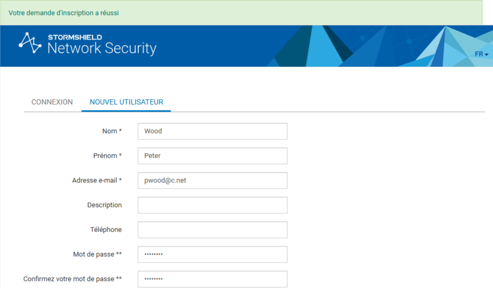

En tant qu'administrateur, j'ai dû valider cette demande manuellement pour que l'utilisateur soit intégré à la base LDAP. Cette étape de validation est critique pour éviter les créations de comptes illégitimes.

Approbation de l'utilisateur par l'administrateur :
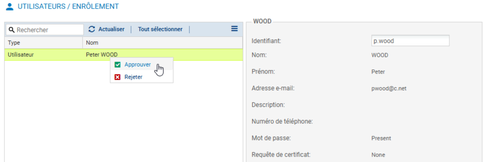

En parallèle, j'ai vérifié la présence de l'utilisateur de référence "John Smith" (jsmith), qui servira pour les tests de privilèges élevés.

Vérification du compte John Smith :
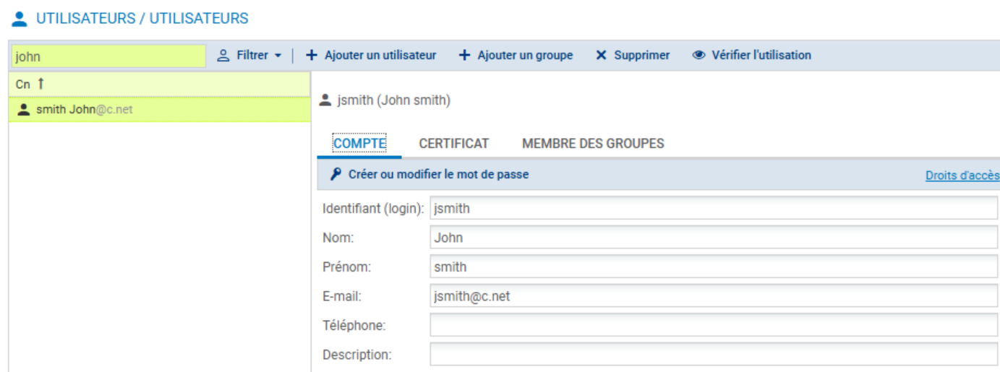

### 2. Gestion des Incidents d'Authentification (Troubleshooting)
Lors d'une tentative de connexion à l'interface de management du firewall avec le compte utilisateur "p.wood", l'accès a été refusé. En adoptant une approche d'analyse défensive, j'ai consulté les journaux système pour identifier la source du rejet.

Log d'erreur d'authentification pour l'utilisateur pwood :
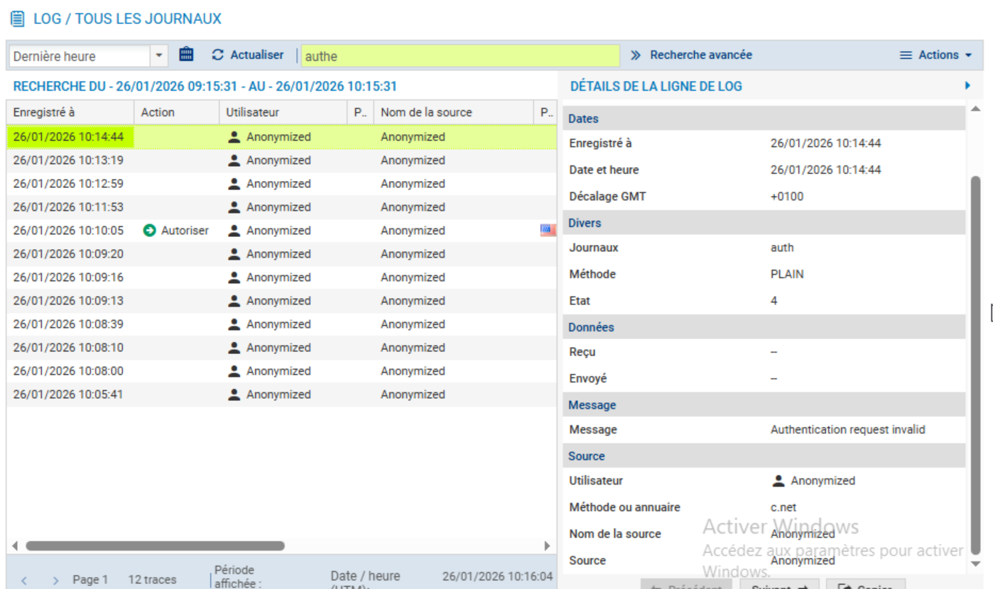

L'analyse a révélé une distinction cruciale entre l'identité et les privilèges : bien que l'utilisateur fût correctement provisionné dans l'annuaire LDAP (lui accordant l'accès réseau via le portail captif), il ne figurait pas dans la liste de contrôle d'accès (ACL) des administrateurs autorisés à se connecter à l'interface de configuration (`/admin`).

Pour remédier à cela tout en respectant le principe du moindre privilège, j'ai intégré "p.wood" au groupe des administrateurs avec un profil restreint en "Lecture Seule". Cette action a permis de valider l'accès à l'interface de supervision pour des besoins d'audit, sans compromettre l'intégrité de la configuration active.

Vérification des droits d'accès administrateurs :
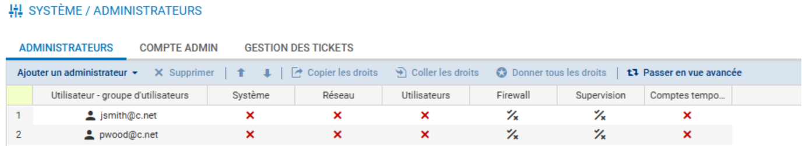

### 3. Mise en Place du Filtrage Basé sur l'Identité
Une fois l'authentification fonctionnelle, j'ai implémenté une politique de sécurité granulaire. L'objectif était d'autoriser le protocole ICMP (Ping) uniquement pour l'utilisateur authentifié "jsmith", tout en le bloquant pour tous les autres utilisateurs authentifiés ou anonymes.

J'ai appliqué le principe du moindre privilège en plaçant la règle spécifique (Allow Jsmith) avant la règle générique (Block All).

Règles de filtrage pour le protocole ICMP :
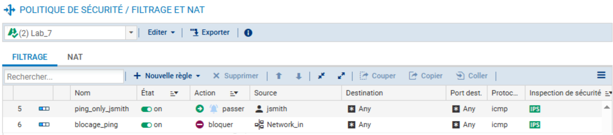

La validation s'est faite via l'analyse des logs de filtrage, confirmant que le trafic ICMP initié par "jsmith" était bien autorisé et associé à son identité.

Point d'attention pour l'analyste : Contrairement aux logs précédents où seule l'IP source était visible, on constate ici que le champ Utilisateur est désormais peuplé avec la valeur jsmith (Anonymized). Cela confirme que le firewall n'autorise plus une machine (IP), mais bien une identité validée.

Log confirmant le passage du trafic pour jsmith :
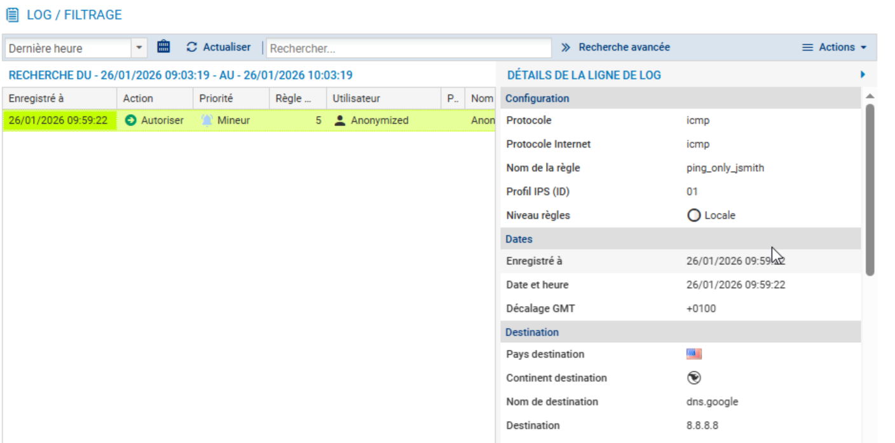

### 4. Configuration du Portail Captif et Exceptions Web
La dernière étape consistait à sécuriser le flux HTTP. La politique définie impose une authentification via portail captif pour tout accès Web, à l'exception des sites de la catégorie "IT" (Informatique) qui doivent rester accessibles sans authentification.

J'ai utilisé l'assistant de création de règles d'authentification pour configurer cette exception "Hormis pour les URL : it".

Utilisation de l'assistant pour créer l'exception IT :
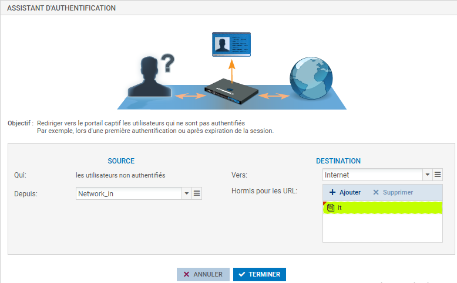

Le résultat est une paire de règles dans une seule : une règle implicite de "Passer" pour la catégorie IT, suivie d'une règle de redirection vers le portail pour le reste du trafic HTTP.

Règles finales de redirection et d'exception, tout en un :
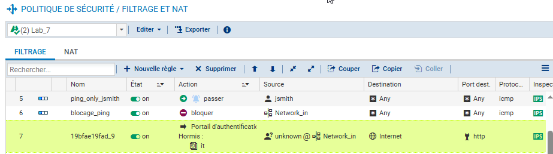

L'interface du portail captif telle qu'elle apparaît pour un utilisateur tentant d'accéder à un site non autorisé (hors IT) :
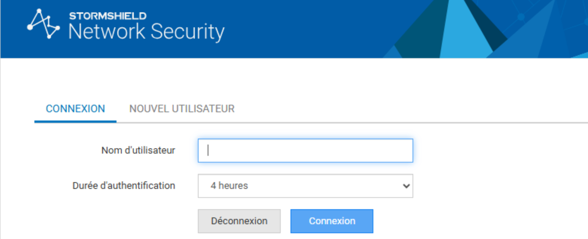

### 5. Délégation de Droits et Supervision
Pour conclure le lab, j'ai validé la délégation de droits en me connectant à l'interface d'administration avec le compte "jsmith". Ce compte possède des droits de lecture sur la supervision (Monitoring/Logs) mais aucun droit d'écriture sur la configuration, validant ainsi la séparation des tâches.

Vue supervision avec le compte restreint jsmith :
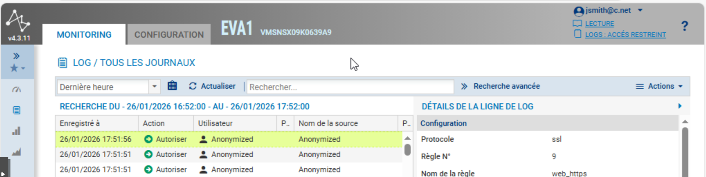

---

## Implications pour un Analyste SOC
Ce laboratoire met en lumière plusieurs points cruciaux pour la surveillance de la sécurité :
1.  **Traçabilité accrue :** Passer de logs basés sur l'IP à des logs basés sur l'utilisateur ("jsmith" au lieu de "192.168.3.10") permet une attribution beaucoup plus rapide et précise lors d'incidents de sécurité.
2.  **Visibilité sur les tentatives d'accès :** Les logs d'erreurs d'authentification ("Authentication request invalid") sont des indicateurs clés (IOC) pour détecter des tentatives de brute-force ou des erreurs de configuration.
3.  **Gestion des exceptions :** Les règles de type "Bypass" (comme l'exception IT) sont des zones de risque potentielles qu'il faut surveiller attentivement pour éviter qu'elles ne soient utilisées pour l'exfiltration de données.
4. Les flux autorisés sans authentification (Bypass) perdent l'attribut utilisateur dans les logs. Pour un analyste, cela signifie qu'une attaque venant de ce flux sera anonyme. Il faut donc compenser par une surveillance accrue des volumes ou des destinations sur cette règle spécifique.

*Fin du rapport de Lab 7.*