# Rapport de Lab 9 : Implémentation et Sécurisation d'un VPN SSL Client-to-Site

**Environnement :** Lab virtuel — Formation CSNA Stormshield (CyberUniversity x La Sorbonne)

## Objectif du Lab
L'objectif de ce laboratoire est de configurer une solution d'accès distant sécurisé (Remote Access VPN) utilisant le protocole SSL/TLS (OpenVPN) sur un pare-feu Stormshield SNS. Contrairement au VPN IPsec (Site-à-Site), le VPN SSL est destiné aux utilisateurs nomades.

La mission consiste à permettre à un collaborateur externe ("John Smith") d'accéder aux ressources internes (LAN et DMZ) de manière chiffrée, tout en appliquant une politique de sécurité stricte : authentification forte, segmentation réseau et filtrage des flux au sein du tunnel.

## Outils et Technologies
* **Firewall :** Stormshield Network Security (SNS).
* **Client VPN :** Stormshield SSL VPN Client (OpenVPN).
* **Protocole :** SSL/TLS (Tunneling TCP/UDP).
* **Monitoring :** Logs d'audit et supervision temps réel Stormshield.

---

## I. Gestion des Identités et des Accès (IAM)

Dans une approche *Blue Team*, la première ligne de défense est le contrôle d'accès. Par défaut, la politique de sécurité applique le principe du moindre privilège : aucun utilisateur n'a le droit d'initier un tunnel VPN.

J'ai d'abord dû modifier les privilèges de l'utilisateur `jsmith` dans l'annuaire local pour lui octroyer explicitement le droit "VPN SSL". Cela permet de s'assurer que seuls les utilisateurs autorisés peuvent tenter une négociation de tunnel, réduisant ainsi la surface d'attaque.

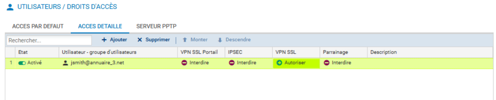

## II. Configuration du Moteur VPN et Segmentation

La configuration du service VPN SSL nécessite la définition de pools d'adresses IP virtuels. Ces adresses sont attribuées aux interfaces virtuelles des clients distants. J'ai configuré deux pools distincts pour séparer les flux UDP et TCP.

Une étape critique a été la configuration du **Split Tunneling** via la section "Réseaux accessibles". Initialement, j'ai restreint le routage pour que seul le trafic à destination de mes réseaux internes (`Network_internals`) passe par le tunnel. Le reste du trafic (navigation personnelle de l'utilisateur) restait sur sa connexion locale, préservant ainsi la bande passante de l'entreprise.

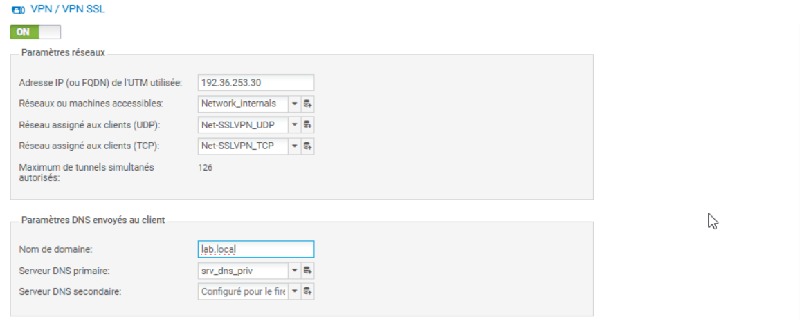

## III. Exposition du Portail d'Authentification

Pour qu'un utilisateur externe puisse télécharger sa configuration (fichier `.ovpn`) et son client, il doit accéder au portail captif du pare-feu. Par défaut, ce portail n'écoute que sur les interfaces internes.

J'ai dû ajouter une règle explicite pour activer l'écoute du portail captif sur l'interface publique (`out`). C'est une modification sensible qui expose une interface d'administration/authentification sur Internet, nécessitant une surveillance accrue des logs d'authentification pour détecter les attaques par force brute.

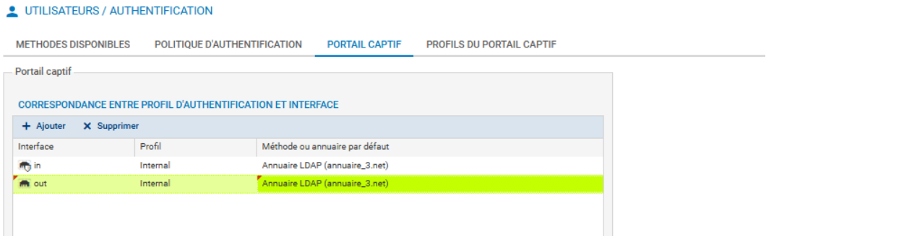

Lors des premiers tests, l'accès était rejeté ("Forbidden") car l'interface n'était pas correctement déclarée dans le profil d'authentification. Cela confirme que le pare-feu rejette par défaut tout ce qui n'est pas explicitement autorisé.

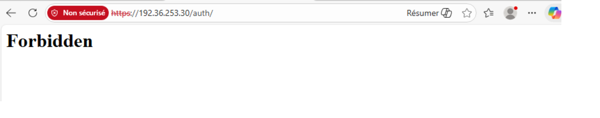

Après correction, l'utilisateur authentifié accède à son espace personnel pour récupérer le binaire d'installation (VPN SSL Client) et sa configuration chiffrée (fichier `.ovpn`).

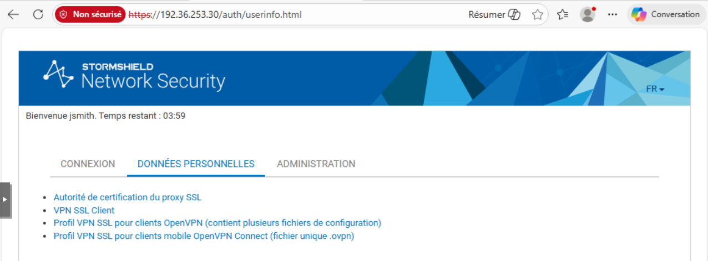

L'utilisateur télécharge ensuite le client SSL VPN Stormshield.

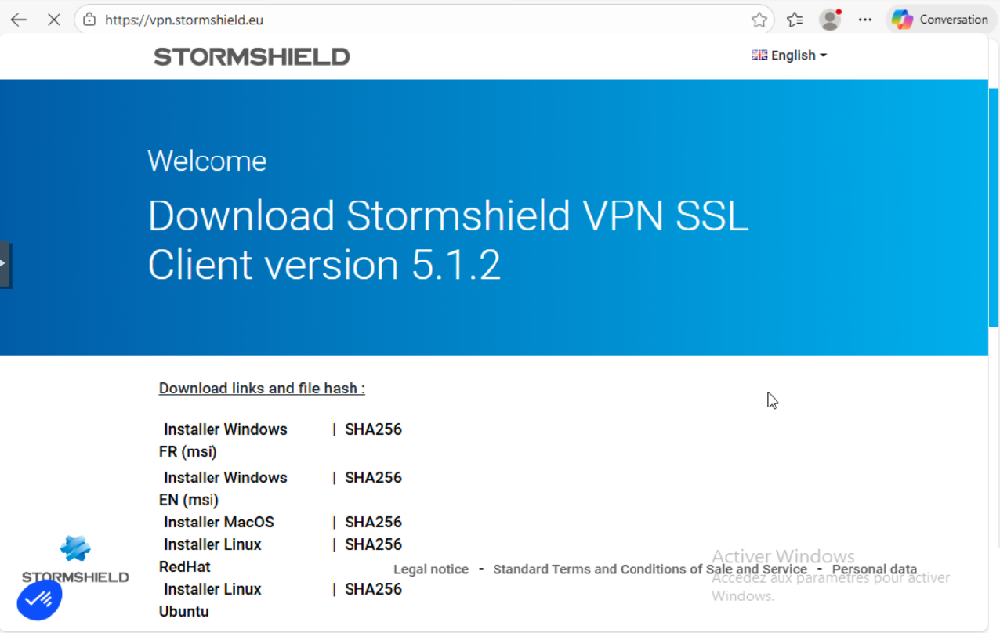

## IV. Politique de Filtrage (La Matrice de Flux)

Le tunnel VPN n'est qu'un tuyau. Sans règles de filtrage, aucun paquet ne transite. J'ai mis en place une politique de filtrage stricte positionnée en **haute priorité** (en haut de la liste) pour éviter les conflits avec des règles plus génériques.

Ma politique se décompose en trois règles essentielles :
1.  **Input_VPN :** Autorise l'établissement du tunnel depuis Internet vers le Firewall (Flux de contrôle).
2.  **VPN_Client_Access :** Autorise le trafic *dans* le tunnel (des clients VPN vers les serveurs internes).
3.  **Out_VPN_Access :** Règle de sortie (optionnelle pour ce lab, mais nécessaire si le firewall agit comme client).

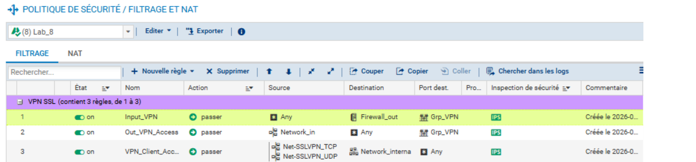

## V. Validation de la Connexion et Analyse des Logs

Une fois le client configuré sur le poste distant, j'ai initié la connexion. Le client Stormshield indique un état "Connecté" (vert), signifiant que la négociation TLS a réussi et que les routes ont été poussées sur le client.

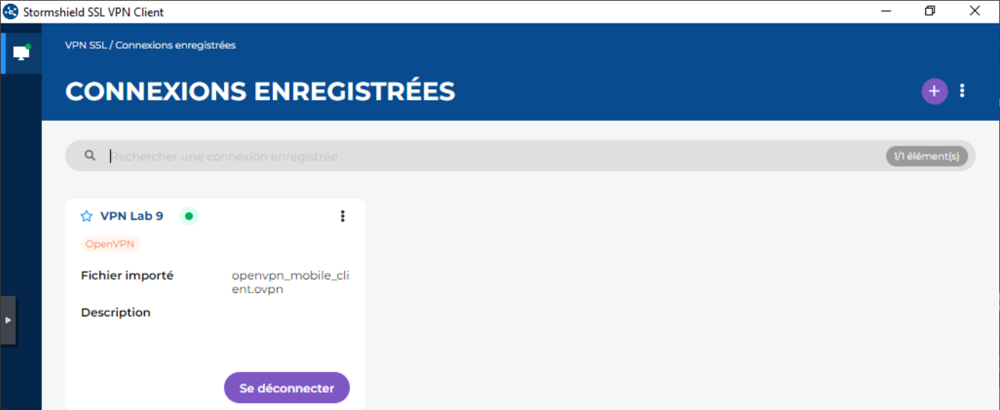

### Analyse des traces (Forensic)
En tant qu'analyste, la validation visuelle ne suffit pas. J'ai vérifié les logs pour confirmer l'intégrité de la connexion.

Dans les logs VPN, on observe la séquence `SSL tunnel created`, confirmant l'attribution de l'IP virtuelle (ici `172.30.3.6`).

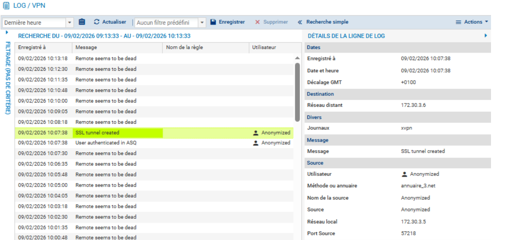

Le monitoring temps réel des utilisateurs authentifiés confirme la présence active de `jsmith` sur le réseau, avec son IP source réelle et son IP VPN attribuée. Cette vue est cruciale pour un SOC afin d'identifier rapidement *qui* est connecté au réseau d'entreprise.

### Test de connectivité
La preuve finale réside dans la capacité à joindre les ressources. J'ai effectué des tests ICMP (Ping) vers la passerelle de la DMZ (`172.16.3.254`) et vers la passerelle interne (`192.168.3.254`). La réponse confirme que le routage et les règles de filtrage sont opérationnels : le flux traverse Internet, est décapsulé par le firewall, inspecté, et routé vers la zone sécurisée.

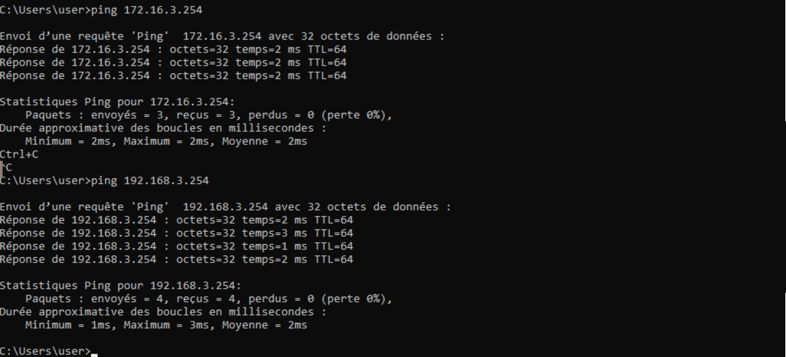

## VI. Hardening : Full Tunneling et Filtrage URL (Bonus)

Pour augmenter le niveau de sécurité et contrôler l'usage d'Internet de l'utilisateur (éviter le *Split Tunneling* qui peut être un vecteur d'exfiltration), j'ai basculé la configuration en "Full Tunneling".

J'ai modifié les routes poussées pour inclure `Any` (Internet), forçant tout le trafic du client à passer par le tunnel pour être inspecté par le firewall.

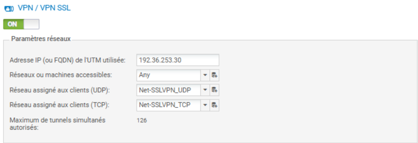

Pour permettre la sortie vers Internet de ces flux encapsulés, j'ai dû configurer une règle de **NAT dynamique (Masquerading)**. Le trafic venant du VPN sort avec l'IP publique du Firewall.

*Point de vigilance SOC* : L'activation du NAT (Masquerading) pour le trafic Internet des clients VPN a une conséquence majeure -> tout le trafic de navigation des télétravailleurs sortira avec l'adresse IP publique de l'entreprise.

**Risque de réputation** : Si un poste compromis effectue des scans ou du téléchargement illégal, l'IP de l'entreprise sera blacklistée.

**Attribution** : Les logs du fournisseur d'accès Internet (FAI) pointeront vers l'entreprise, rendant les logs internes du Firewall (association User <-> Trafic) juridiquement vitaux pour disculper l'infrastructure.

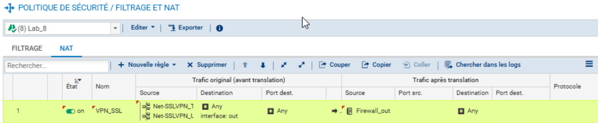

Enfin, j'ai appliqué une politique de filtrage URL stricte sur ce flux Web. L'objectif est de limiter l'accès aux catégories professionnelles (`IT`, `News`) et de bloquer le reste (ex: `Games`).

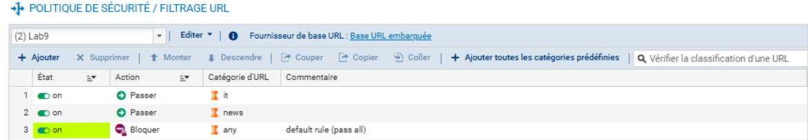

La règle de filtrage correspondante applique ce profil et active l'inspection IPS. L'avertissement sur l'absence de déchiffrement SSL indique que le filtrage se fera sur le SNI (Server Name Indication), ce qui est suffisant pour un filtrage par catégorie de domaine.

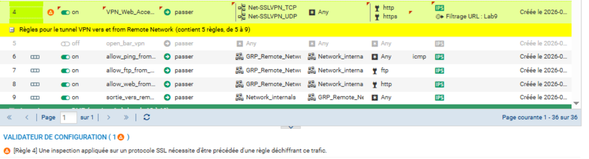

*Résolution de problème (Troubleshooting DNS) : Lors des premiers tests de Full Tunneling, la connectivité IP était fonctionnelle (Ping OK) mais la navigation Web échouait. L'analyse a révélé que le client VPN tentait d'utiliser les DNS de sa carte réseau physique (locaux) qui n'étaient plus accessibles une fois le tunnel monté.*

*Correction appliquée : J'ai configuré le service VPN SSL pour "pusher" explicitement les serveurs DNS (ceux de la DMZ ou publics comme 8.8.8.8) vers le client virtuel. Cela garantit que la résolution de noms transite bien par le tunnel chiffré, évitant au passage les fuites DNS (DNS Leaks).*

---

## Implications pour un Analyste SOC

Ce laboratoire met en lumière plusieurs points de vigilance pour la surveillance de sécurité :

1.  **Géolocalisation des IP sources :** Surveiller les connexions VPN provenant de pays inhabituels ("Impossible Travel").
2.  **Heures de connexion :** Une connexion VPN réussie en pleine nuit pour un utilisateur local est un IoC (Indicator of Compromise) potentiel.
3.  **Volume de données :** Un tunnel VPN stable avec un volume de transfert sortant massif peut indiquer une exfiltration de données.
4.  **Échecs d'authentification :** Un pic d'échecs sur le portail captif exposé sur le WAN est un signe précurseur d'une attaque par dictionnaire.
5.  **Conformité du poste :** L'importance de ne pas autoriser le Split Tunneling sur des postes non maîtrisés pour éviter qu'ils ne servent de passerelle (pivot) entre un réseau domestique compromis et le réseau d'entreprise.

*Fin du rapport de Lab.*